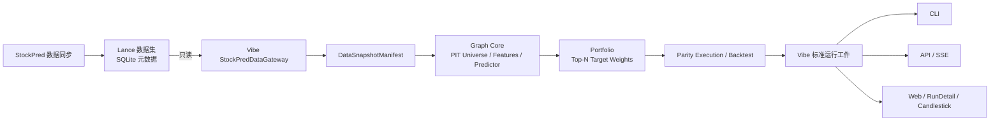

# StockPred Graph 迁移至 Vibe-Trading 的回测与可视化设计

- 状态：已确认
- 日期：2026-07-02
- 目标仓库：Vibe-Trading
- 数据生产方：StockPred

## 1. 背景与目标

StockPred 已具备 A 股分层数据、PIT 股票池、Graph 特征和预测、风险叠加及本地回测能力；Vibe-Trading 已具备统一运行工件、回测详情页、蜡烛图、交易标记、净值展示、CLI/API/Web 入口。

本次改造不是让 Vibe 调用 StockPred 的完整程序，也不是长期维护两套 Graph 实现。目标是：

1. StockPred 继续负责数据同步、数据质量和分层 Lance/SQLite 数据治理。
2. Graph 研究核心完整迁移到 Vibe，Vibe 直接只读 StockPred 数据。
3. Vibe 负责 PIT 股票池、Graph 特征、预测、组合、撮合、回测工件和展示。
4. 提供 Vibe 专用 CLI、API 和独立 Web 配置页。
5. 回测结果复用 Vibe 现有 RunDetail、蜡烛图、交易标记和净值体系。
6. 迁移期逐层与 StockPred 原生 Graph 回测对账，证明行为等价后再切换所有权。

首期范围仅覆盖 Graph 策略最小闭环：全 A 股 PIT 股票池、Top-N 周期调仓、沪深 300 基准、原生执行语义和可视化。其他 StockPred 策略、在线实盘、参数优化和网络数据回退不在首期范围。

## 2. 第一性原理分析

### 2.1 明确问题

需要迁移的是 Graph 策略的实现所有权，同时保持相同数据快照下的可观察行为。仅比较最终收益率不能证明迁移正确，因为不同股票池、排序或成交路径可能偶然产生接近的总收益。

### 2.2 基本事实

一次 Graph 回测由数据快照与可见时间、交易日历与 PIT 股票池、复权与特征、Graph 预测与风险叠加、目标组合、交易约束和指标汇总共同决定。

### 2.3 不可变约束

- StockPred 是分层数据的唯一写入方，Vibe 只能读取。
- 评价日只能使用当时已公布、已生效的数据，不得引入未来信息。
- 每次运行必须固定数据快照、模型版本和配置摘要。
- CLI、API、Web 必须调用同一应用服务，不能形成多套回测语义。
- Vibe 生产运行不得依赖导入 StockPred Python 包或全局 `PROJECT_ROOT`。
- 缺表、schema 不兼容或 PIT 条件无法验证时必须失败，不能静默降级。

### 2.4 推导方案

采用分层绞杀迁移：先冻结 StockPred 基线，再依次迁移数据网关、Graph Core、执行与工件，最后开放产品入口。每一层都有独立差分测试和验收门，前一层不等价时不能继续切换下一层。

## 3. 总体架构与职责



### 3.1 StockPred 的长期职责

- 同步原始和派生数据；
- 管理 Lance 数据集、SQLite 元数据和表版本；
- 保证交易日、证券历史状态、公告可见时间等数据语义；
- 暴露稳定的数据契约和快照水位；
- 不再承载迁移后的 Graph 生产模型与回测入口。

### 3.2 Vibe 的长期职责

- 通过 DataGateway 只读 StockPred 数据；
- 计算 PIT 股票池、复权、特征、Graph 预测和风险叠加；
- 生成目标组合并执行原生兼容撮合；
- 输出标准工件与 Graph 审计工件；
- 提供 CLI、API、Web 配置、进度和结果展示；
- 成为 Graph 策略唯一生产实现。

StockPred 当前 Graph 实现仅在迁移期作为离线 oracle 保留。Vibe 完成验收并稳定运行一个发布周期后，参考实现冻结归档，不再接受功能演进。

## 4. Vibe 模块设计

```text
agent/src/stockpred/
├── contracts.py              # schema、错误码、snapshot manifest
├── gateway.py                # 唯一 Lance 读取边界
├── snapshot.py               # 固定和校验数据水位
└── graph/
    ├── config.py             # Graph 模型及回测配置
    ├── universe.py           # PIT 股票池
    ├── adjustment.py         # 复权与覆盖率质量门
    ├── features/             # 纯函数特征模块
    ├── predictor.py          # score、direction、stage
    ├── risk_overlay.py       # 风险叠加
    ├── portfolio.py          # 排序和目标权重
    └── service.py            # 单次运行应用服务

agent/backtest/stockpred_graph/
├── runner.py                 # 历史评价日循环
├── execution.py              # 原生对齐执行语义
└── artifacts.py              # 标准工件和 Graph 审计工件
```

约束：

- 只有 `gateway.py` 知道 Lance 路径和物理 schema。
- Graph 模型只接收规范化 DataFrame 或领域对象。
- 不把 StockPred 预计算 Graph 特征作为生产输入；特征在 Vibe 内从基础数据重算。
- CLI、API handler 和页面不得直接编排特征、组合或撮合。
- 首期不引入通用插件抽象，只实现本次所需边界。

## 5. 数据契约

### 5.1 数据快照

每次 run 在计算开始前生成并固定 `DataSnapshotManifest`：

```json
{
  "contract": "stockpred-data/v1",
  "as_of": "2026-06-30T15:00:00+08:00",
  "tables": {
    "stock": {"version": 812, "max_date": "20260630"},
    "fact_adj_factor": {"version": 94, "max_date": "20260630"},
    "fact_fina_indicator": {"version": 36, "max_date": "20260630"}
  },
  "model": {
    "id": "stockpred-graph",
    "version": "graph-v1",
    "config_sha256": "..."
  }
}
```

真实 manifest 必须包含本次运行读取的全部表。run 执行期间不得自动切换到更新后的 Lance 版本。

### 5.2 首期必需表

- `dim_stock`
- `dim_stock_name_history`
- `bridge_stock_industry`
- `dim_trade_cal`
- `stock`
- `fact_adj_factor`
- `fact_stock_limit`
- `fact_stock_daily_basic`
- `fact_moneyflow`
- `fact_index_weight`
- `fact_index_daily`
- `fact_fina_indicator`

若 Graph 当前生产配置实际依赖额外本地风险表，应在迁移 Phase 0 冻结依赖清单，并加入 manifest 和 Gateway 契约；不能在模型内部绕过 Gateway 读取。

### 5.3 Gateway 公共能力

- 市场与证券：交易日、证券维度、名称/ST 历史、行业历史；
- 行情与执行：日线、复权因子、涨跌停状态、指数日线；
- 特征输入：每日指标、资金流、指数权重、PIT 财务指标。

Gateway 出口统一完成列名、类型、时区、日期格式、去重和确定性排序。模型层不接触 Lance 表达式。

### 5.4 PIT 与复权规则

- 上市、退市、名称/ST 和行业均按评价日有效区间查询。
- 财务记录必须满足 `ann_date` 或规范化 `available_time <= eval_date`。
- 复权沿用 StockPred 当前前复权公式：`adj_price = raw_price * adj_factor / latest_adj_factor`。
- 预期证券的复权因子覆盖率低于 98% 时整次运行失败。
- 不允许复权缺失时退回原始价格继续计算。

## 6. Graph 与组合语义

### 6.1 原生对齐配置

首期默认启用 `parity_mode`：

| 参数 | 默认值 |
|---|---:|
| 特征回看期 | 120 交易日 |
| 数据加载回看期 | 180 交易日 |
| 前瞻/持有期 | 5 交易日 |
| 评价步长 | 5 交易日 |
| Top-N | 50 |
| 基准 | `000300.SH` |
| 最少上市交易日 | 60 |
| 排除 ST | 是 |
| 要求 PIT 行业 | 是 |
| 市场范围 | SSE、SZSE |
| 复权覆盖率下限 | 98% |
| 有效评价日比例下限 | 90% |
| 初始组合资金 | 10,000,000 CNY |
| 最大成交参与率 | 5% |
| 佣金 | 15 bps |
| 卖出印花税 | 10 bps |

### 6.2 缓冲选择的兼容结论

StockPred 当前默认 `top_n=50`、`buffer_retain_rank=15`。现有 `select_buffered_portfolio()` 只在排名前 `retain_rank` 中保留旧持仓，再从完整排名顺序补足 `target_size`。由于 15 小于 50，最终结果仍是纯 Top-50，缓冲参数对默认组合没有实际影响。

因此，`parity_mode` 必须原样复现当前行为；页面不能把它描述为“Top-50 外再缓冲 15 名”。若未来需要有效换手缓冲，应单独设计、回测和版本化，不能作为迁移修复混入首期。

### 6.3 确定性

- 相同分数使用固定证券代码作为次级排序键；
- 输入进入计算前按明确键排序；
- 模型版本、配置和依赖版本写入 manifest；
- 同一快照和配置重复运行，关键工件内容 hash 必须一致。

## 7. 执行语义

对齐模式复现 StockPred 当前规则：

1. 评价日收盘后使用当日可得数据生成目标组合；
2. 下一交易日以复权开盘价尝试买入；
3. 缺行情、缺开盘价、停牌或涨停时禁止买入；
4. 到达持有/调仓退出日后，在首个可卖交易日开盘价卖出；
5. 停牌或跌停导致卖出顺延；
6. 单笔交易受当日成交额 5% 容量约束；
7. 滑点为 `clip(5 + 200 × participation_rate, 5, 30)` bps；
8. 买卖收取 15 bps 佣金，卖出额外收取 10 bps 印花税；
9. 未成交或部分成交的资金留在现金，不静默换入其他证券；
10. 每个未成交、部分成交或顺延事件写入状态和结构化原因。

执行模块不得读取未来交易状态来提前修改评价日组合。

## 8. 应用服务、CLI 与 API

### 8.1 单一应用服务

`GraphBacktestService` 是唯一用例入口，依次锁定快照、构建 PIT 股票池、计算 Graph、生成组合、执行撮合、写工件并原子发布 run。CLI 直接调用该 service；API 后台任务也调用同一 service。

### 8.2 CLI

```text
vibe-trading stockpred status [--json]
vibe-trading stockpred graph-backtest \
  --start YYYY-MM-DD \
  --end YYYY-MM-DD \
  [--mode parity|research] \
  [--top-n N] [--eval-step N] [--json]
```

默认处于 parity mode，`top-n`、`eval-step` 等兼容参数锁定；只有显式选择 `--mode research` 才允许覆盖。成功时输出 `run_id` 和 run 目录；失败时输出稳定错误码和可操作说明。实现遵循 Vibe 现有模块化 subparser/handler 模式，不向 legacy CLI 堆叠业务逻辑。

### 8.3 API

- `GET /stockpred/status`：数据根目录、契约版本、必需表和最新水位；
- `GET /stockpred/graph/defaults`：页面默认配置和锁定字段；
- `POST /stockpred/graph/backtests`：创建 run，返回 `202`、`run_id` 和事件地址；
- `GET /stockpred/graph/backtests/{run_id}/events`：SSE 进度与终态；
- 现有 `GET /runs/{run_id}`：读取最终标准结果。

运行状态持久化到 run 目录，不能只存在 API 进程内存。首期不要求暂停、恢复或远程取消。

```text
QUEUED -> VALIDATING -> RUNNING -> FINALIZING -> SUCCEEDED
                    \-> FAILED       \-> FAILED
```

## 9. Web 与可视化

### 9.1 独立 StockPred 页面

在现有侧栏新增 `StockPred` 导航项，路由为 `/stockpred`。页面复用 Vibe 的卡片、表单、状态标签、进度和运行列表样式，包含数据状态、日期范围、基准、Graph 配置、parity mode、启动按钮、SSE 进度和最近 runs。完成后打开现有 RunDetail。页面只调用 API，不在浏览器中计算策略。

### 9.2 RunDetail 兼容扩展

- 图表页显示蜡烛图、现有技术指标和 Graph 实际成交标记；
- 标记区分买入、卖出、未成交和顺延事件；
- 新增仅对 `strategy_type=stockpred_graph` 显示的 `Graph 诊断` 标签或信号轨；
- Graph 诊断显示 score、rank、direction、stage、风险调整和 action；
- Graph score 不叠加到价格 Y 轴，使用独立比例尺；
- 非 Graph run 的页面结构和行为保持不变。

浏览器不加载全 A 股信号和行情。仅为实际持仓或尝试成交的证券生成或按需读取 K 线；全截面信号保留为 Parquet 审计工件。

## 10. 运行工件

### 10.1 复用的 Vibe 标准工件

- `state.json`
- `config.json`
- `metrics.csv`
- `equity.csv`
- `positions.csv`
- `trades.csv`
- 现有 RunDetail 所需的选择性 OHLCV/price series

### 10.2 Graph 专属工件

- `data_snapshot.json`：表版本、水位和契约；
- `model_manifest.json`：模型、配置和依赖摘要；
- `signals.parquet`：逐评价日全截面特征、预测、风险调整和排名；
- `selected_signals.csv`：入选或尝试成交证券的信号摘要；
- `parity.json`：迁移、shadow 或验收 run 的逐层差分统计、阈值和通过状态；普通生产 run 可不生成；
- `run_card.json`：策略类型、显示元数据和关键口径。

大文件写入临时目录，所有必需工件完成并校验后再原子发布。失败 run 仍保留状态、snapshot、日志和结构化错误信息。

## 11. 失败处理

### 11.1 整次运行硬失败

- 必需表、字段、PIT 时间字段或 schema 缺失；
- 数据水位不足以覆盖请求区间；
- run 期间快照无法保持一致；
- 模型 ID、版本或配置 hash 不匹配；
- 复权覆盖率低于 98%；
- 有效评价日比例低于 90%；
- 工件写入或最终校验失败；
- 标记为迁移、shadow 或验收用途的 run 未通过 parity 门；
- 未捕获异常。

错误使用稳定 `error_code`，CLI、API 和 Web 显示同一含义。

### 11.2 可继续的交易业务事件

停牌、涨跌停、容量不足、部分成交和卖出顺延不属于系统失败。它们进入交易事件工件，记录日期、证券、方向、请求数量、成交数量、状态和原因。未成交资金保留为现金。

## 12. 分阶段迁移

### Phase 0：冻结基线

- 固定 StockPred 模型提交、配置、Python/数值依赖和数据快照；
- 选择正常行情、财务公告边界、停牌/涨跌停/容量约束三类 golden 窗口；
- 导出股票池、特征、预测、组合、交易和净值基准；
- 明确全部实际依赖表和字段。

验收门：基线可重复生成，关键工件 hash 稳定。

### Phase 1：DataGateway 与快照

- 在 Vibe 实现数据契约、Gateway 和 snapshot；
- 对账交易日、证券历史状态、行业、PIT 财务和复权结果；
- 加入 schema/覆盖率契约测试。

验收门：逐评价日股票池、排除原因和数据键完全一致。

### Phase 2：Graph Core

- 按纯函数边界迁移特征、predictor、risk overlay 和组合；
- Vibe 与 StockPred 在同一 manifest 上 shadow run；
- 输出逐字段差分报告。

验收门：数值在容差内，排序、Top-50 和目标权重决策一致。

### Phase 3：执行与工件

- 迁移原生执行语义；
- 输出标准工件和 Graph 审计工件；
- 对账每笔委托、拒绝原因、成交、现金、持仓和 NAV。

验收门：事件路径一致，全部 golden 窗口 parity 通过。

### Phase 4：CLI/API/Web

- 增加模块化 CLI、API、持久状态、SSE 和 `/stockpred` 页面；
- 条件扩展 RunDetail 和 Graph 诊断。

验收门：三个入口调用同一 service，端到端结果一致，非 Graph 页面回归通过。

### Phase 5：切换与归档

- Vibe 成为唯一生产 Graph 实现；
- StockPred 参考实现只读冻结一个发布周期；
- 观察期内继续定期差分；
- 无阻断差异后归档 StockPred Graph 生产入口。

## 13. 测试与验收标准

### 13.1 测试层次

- 单元测试：PIT 边界、复权、特征、确定性排序、成本、滑点和成交限制；
- 契约测试：Lance schema、Gateway 输出、API、SSE 和 run 工件；
- 差分测试：Vibe 与冻结 StockPred oracle 的逐层 golden 对账；
- 集成测试：完整短窗口回测、失败 run 和原子工件发布；
- 前端测试：配置校验、状态进度、RunDetail K 线、交易标记和 Graph 诊断；
- 回归测试：现有非 Graph 回测详情保持不变。

### 13.2 差分通过条件

| 层 | 比较对象 | 通过条件 |
|---|---|---|
| 数据 | manifest、交易日、股票池、排除原因 | 键、集合和原因完全一致 |
| 模型 | 特征、score、direction、stage | `rtol=1e-8`、`atol=1e-10` |
| 组合 | 排序、目标证券、目标权重 | 顺序和决策一致；浮点权重满足相同容差 |
| 执行 | 日期、数量、状态、拒绝原因、价格、成本 | 事件键完全一致；货币金额四舍五入到分后相同 |
| 结果 | 逐日现金、持仓、NAV、指标 | `rtol=1e-8`，且无路径差异 |

任何排序、目标证券、成交状态或拒绝原因差异均阻断切换，即使最终收益接近。若数值差异超过容差，应定位算法或依赖差异，不能放宽阈值掩盖问题。

### 13.3 最终完成标准

1. 全部 golden 窗口的 `parity.json` 通过；
2. 同一 manifest 和配置重跑时关键工件 hash 一致；
3. Vibe 运行期不导入 StockPred Python 包；
4. CLI、API 和 Web 使用同一 `GraphBacktestService`；
5. `/stockpred` 可配置、启动并跟踪回测；
6. RunDetail 可查看净值、持仓、交易和相关证券蜡烛图；
7. Graph 诊断可解释评价日信号和最终 action；
8. 现有非 Graph 页面与回测行为无回归；
9. StockPred 保持数据同步职责，Vibe 不写其数据存储。

## 14. 已确认的设计决策

- 采用分层绞杀迁移，不一次性复制全部代码；
- Graph 完整核心最终只保留在 Vibe；
- StockPred 只负责同步和治理数据；
- 首期使用全 A 股 PIT 股票池，基准为沪深 300；
- 首期默认 Top-50、每 5 个交易日调仓；
- 新增 Vibe 专用 CLI/API 和独立 StockPred Web 页面；
- 结果复用现有 RunDetail，不新建第二套详情体系；
- Graph score 使用独立诊断比例尺，不叠加到价格轴；
- 对账以逐层决策和事件路径为准，不以最终收益相近为准；
- 默认缓冲参数的无效行为在 parity mode 中原样保留。

## 15. 2026-07-07 实施与验证记录

本节记录实际落地结果，不改变前文设计决策。

### 15.1 已落地能力

- Vibe 已具备 StockPred 专用 CLI、API/SSE 和 `/stockpred` Web 页面。
- Vibe 后端通过只读 Gateway 读取 StockPred Lance 数据，不写入 StockPred 数据存储。
- Graph 核心预测、PIT universe、复权、执行、artifact、RunDetail 蜡烛图标记和 Graph 诊断面板已接入。
- Web RunDetail 使用完整 Vibe artifacts；parity 对账使用 Oracle-compatible view，避免把 Web ledger 语义强行改成 frozen Oracle summary 语义。

### 15.2 关键修正

- snapshot watermark 改为 Arrow columnar max，避免整列 `to_pylist()` 导致状态检查超时。
- Gateway 大量股票代码过滤改为 `IN (...)`，避免 Windows Lance 在深 OR 表达式下栈溢出。
- parity 默认交易所范围修正为 frozen Oracle 的 `SSE/SZSE`。
- universe 退市名称正则修复为 `退市|退$`，恢复 `退市卓朗` 等历史名称过滤。
- parity view 使用 Oracle forward market 截止日：`last_eval + forward_days * 2 calendar days`。
- parity metrics 复算 frozen Oracle 的 Top-N、benchmark、advisor 和容量/成本指标。
- signals 全市场诊断层设置列级容差；Top-N 结果仍由 selected/trades/equity/metrics 层硬校验。

### 15.3 验证结果

- `pytest agent/tests/stockpred -q -p no:cacheprovider --basetemp <TEMP>`：94 passed，1 个 FastAPI/TestClient deprecation warning。
- `ruff check --no-cache agent/src/stockpred agent/backtest/stockpred_graph agent/tests/stockpred`：passed。
- normal golden 完整 CLI：`graph_20260707T161617_b8956750`，status success。
- pit-boundary golden：`graph_20260707T162300_29f02703` 的 artifacts 在当前 comparator 下重建比较 passed。
- execution-edge golden：`graph_20260707T163354_d564a35b` 的 artifacts 在当前 comparator 下重建比较 passed。

### 15.4 运维文档

新增 `docs/stockpred-graph-operations.md`，记录环境变量、CLI/API/SSE、artifact、parity 口径、错误码和排错顺序。
