# StockPred 场内 ETF 动态聚类轮动集成设计

**日期：** 2026-08-01

**状态：** 待用户书面审阅

**目标仓库：** `Vibe-Trading`

**数据源仓库：** `StockPred`

## 1. 问题与目标

将 StockPred 中的基金相关性研究迁移为 Vibe-Trading 原生的场内 ETF 动态聚类轮动策略，并同时完成数据、通用回测引擎、后端 API、任务进度、回测产物和前端 UI 闭环。

本次迁移保留以下研究思想：

1. 使用历史周收益相关性对场内 ETF 动态聚类。
2. 每隔固定周期重新聚类。
3. 按近期聚类动量选择排名最高的若干聚类。
4. 选中聚类之间等权，聚类内所有合格 ETF 等权。

本次迁移不追求复现旧脚本的错误数值。原研究脚本使用裸收盘价收益、全样本资格过滤、不适配相关距离的 Ward 聚类、聚类级成本估计和隐含的理想成交。新实现保留策略结构，修正数据与回测语义。

## 2. 第一性原理拆解

### 2.1 基本事实

- 相关性描述共同波动，不直接预测未来收益，因此聚类负责分组，动量负责选择。
- ETF 除权、分红或份额变化会使裸收盘价产生虚假收益，必须使用 `fund_adj`。
- 轮动策略最终交易的是基金份额，不是抽象聚类；成本和容量必须基于基金级权重变化。
- 方向信号是目标权重的特例，执行层没有必要维护方向执行和权重执行两套模型。
- Lance 具有事务版本号；版本固定可以保证运行输入可重放，但不能自动保证历史时点可见性。
- 当前 Vibe-Trading 的 `_align()` 已能把多品种信号归一化为权重，但 `_rebalance()` 只在开平仓或反向时交易，不能执行同方向加减仓。

### 2.2 不可变约束

- 每个调仓信号只能使用信号时点及以前的数据。
- 信号整体后移一根该品种可交易 bar，在下一交易日开盘执行。
- 缺少基金复权因子时不得回退到裸收盘价。
- 未成交权重不得免费分配给其他基金。
- 正式回测参数必须在运行前固定，不能从同一全样本中自动挑选最优夏普参数。
- 现有方向策略必须迁移到唯一目标权重执行接口；新接口验证通过后删除旧执行接口。

## 3. 已确认的产品决策

- 可投资池仅包含 StockPred 场内基金数据中的 ETF。
- ETF 身份以 `fund_basic(market="E")` 与 `fund_adj` 覆盖的交集为准，不依赖名称包含“ETF”的模糊匹配。
- 不按资产类别排除 ETF；股票、债券、商品、跨境、货币、杠杆或反向 ETF 均可进入初始候选池，只要满足同一时点资格规则。
- 选中聚类之间等权，聚类内全部当期合格 ETF 等权。
- 基准参数为：`K=8`、`Top-N=3`、动量回看 4 周、每周调仓、每 26 周重新聚类、最少 52 周初始训练、单只 ETF 聚类计算最少 20 周有效历史。
- 前端采用 StockPred 页面内独立“基金轮动”页签。
- 扩展当前通用引擎为唯一目标权重执行引擎，不保留运行时双模式。

## 4. 总体架构

```mermaid
flowchart LR
    subgraph SP["StockPred 数据事实层"]
        TS["Tushare fund_adj"] --> ING["增量更新与历史回填"]
        ING --> LANCE["fund · dim_fund · fact_fund_adj · dim_trade_cal"]
    end

    subgraph VT["Vibe-Trading 数据与任务层"]
        LANCE --> SNAP["Lance 版本清单与可见日期约束"]
        SNAP --> API["基金轮动 REST 与 SSE 任务"]
    end

    subgraph ST["策略层"]
        API --> UNI["时点 ETF 可投资池"]
        UNI --> RET["复权日收益与周收益"]
        RET --> CORR["历史相关性矩阵"]
        CORR --> CLUSTER["动态聚类"]
        CLUSTER --> MOM["聚类动量排序"]
        MOM --> TARGET["ETF 目标权重事件"]
    end

    subgraph EN["统一目标权重引擎"]
        TARGET --> SHIFT["整体后移一根 bar"]
        SHIFT --> DELTA["组合级目标差额"]
        DELTA --> SELL["先减仓与平仓"]
        SELL --> BUY["再加仓与开仓"]
        BUY --> RULES["市场规则、容量与费用"]
        RULES --> LEDGER["成交、持仓、现金与净值"]
    end

    subgraph UI["产物与前端"]
        LEDGER --> ART["可审计回测产物"]
        ART --> PAGE["StockPred / 基金轮动页签与结果详情"]
    end
```



职责边界如下：

- StockPred 负责 Tushare 数据采集、分层存储和可追溯版本，不运行正式策略回测。
- Vibe-Trading 读取固定 Lance 版本，并在历史调仓点执行可见性过滤、策略计算、交易模拟和报告生成。
- 通用引擎只接收目标权重事件；方向、分数、排序和优化器均属于上游目标构建过程。

## 5. StockPred 数据层改动

### 5.1 新增数据集

新增 `fact_fund_adj`：

| 字段 | 类型 | 含义 |
|---|---|---|
| `ts_code` | string | ETF 代码 |
| `trade_date` | string | 交易日，`YYYYMMDD` |
| `adj_factor` | double | Tushare `fund_adj` 复权因子 |
| `updated_at` | string | 本地写入时间 |

主键为 `(ts_code, trade_date)`，排序键相同，存储位置为 `data/lance/market_core/fact_fund_adj.lance`。SQLite 元数据层同步登记该表，以保持现有分层数据契约一致。

### 5.2 采集与更新

- 在 `tushare_research_ingest.py` 中新增 `fund_adj` 作业，采用按交易日增量拉取。
- 纳入每日更新、历史回填、数据层配置、数据契约和新鲜度检查。
- 更新必须幂等；相同主键再次写入时以最新抓取记录覆盖。
- 首次集成前完成策略回测区间的历史回填。
- `fact_adj_factor` 仍只表示股票复权因子，不与基金复权因子混表。

### 5.3 数据质量门禁

- 表或必需字段缺失：整个任务失败。
- 非正数、非有限复权因子：对应 ETF 在该评价时点不合格，并写入排除原因。
- ETF 在所需收益窗口内存在行情但缺少对应复权因子：该 ETF 不得使用裸价格替代。
- 数据集整体覆盖率、排除数量和原因分布写入运行产物；若初始训练期可聚类 ETF 少于 `K`，任务失败。

## 6. Lance 版本清单与历史可见性

每次运行创建 `DataSnapshotManifest`，至少固定：

```json
{
  "contract": "stockpred-data/v2",
  "as_of": "2026-08-01T18:00:00+08:00",
  "tables": {
    "fund": {"version": 41, "max_date": "20260731"},
    "dim_fund": {"version": 43, "max_date": null},
    "fact_fund_adj": {"version": 1, "max_date": "20260731"},
    "dim_trade_cal": {"version": 12, "max_date": "20261231"}
  }
}
```

运行重放时必须使用 `lance.dataset(path, version=recorded_version)`。清单同时记录 schema 哈希；schema 不匹配时失败。

快照构建器改为接受任务声明的依赖表集合。基金轮动只强制检查 `fund`、`dim_fund`、`fact_fund_adj` 和 `dim_trade_cal`，不得因为与本策略无关的股票财务表缺失而失败；现有 StockPred Graph 任务继续声明自己的完整依赖集合。

版本固定只保证“本次运行输入可复现”。历史调仓点仍按以下规则过滤：

- `trade_date <= signal_date`
- `list_date <= signal_date`
- 只使用截至该日已经出现的行情和复权记录
- 不使用全样本最终交易天数、最终存续状态或未来退市信息筛选历史基金池

StockPred 不得物理清理由任何保留回测清单引用的 Lance 版本。若未来引入旧版本清理，必须先建立引用检查或归档机制。

## 7. 统一目标权重引擎

### 7.1 唯一执行契约

执行引擎的标准输入为目标权重事件矩阵：

- 行索引：信号时间。
- 列：品种代码。
- 值：有符号目标净值权重。
- 每行总绝对权重不得超过允许的组合杠杆。
- 权重矩阵整体后移一根各品种交易 bar 后执行。

现有方向策略继续输出原始信号，由目标构建器转换：一个多头默认为 100%，多个同向信号默认等权，多空信号按总绝对权重归一化；优化器可以替换默认权重。执行器不再接收方向模式参数。

### 7.2 目标事件

- 仅当完整目标权重向量发生变化时创建新事件。
- 目标不变时不为了修复日常价格漂移而反复交易。
- 新目标到达时，取消上一目标产生的剩余未成交订单，再按当前持仓与新目标重新计算差额。
- 未成交订单只重试事件生成时冻结的剩余数量，不因价格漂移扩大订单；持续到成交完成或下一目标替换。

### 7.3 组合级成交顺序

每个目标事件按以下顺序执行：

1. 使用当日开盘价格计算调仓前净值和当前敞口。
2. 计算所有品种的目标数量和数量差额。
3. 执行平仓和减仓，释放现金或保证金。
4. 按目标买入金额比例执行加仓和开仓，避免代码排序决定资金分配。
5. 应用市场钩子、整手规则、成交容量、滑点和手续费。
6. 更新剩余订单、持仓成本、已实现损益、现金和当日收盘净值。

资金不足或部分成交时不把缺口重新分配给其他品种。

### 7.4 持仓与成交语义

- 同方向加仓：更新加权平均入场价，并累计入场费用。
- 部分减仓：仅对减仓部分确认损益，按比例分摊历史入场费用。
- 方向反转：先完全关闭原方向，再按剩余目标建立新方向。
- 每次部分成交均产生可审计的订单/成交事件；闭合部分继续生成现有 `TradeRecord` 兼容指标。
- 引擎结束时按照市场规则尝试平仓；无法平仓的残余持仓以明确的终值估值规则记录，不伪造成交。

### 7.5 旧接口迁移

迁移完成后删除逐品种旧 `_rebalance` 及相关方向执行分支。所有现有市场引擎、信号引擎、优化器、CLI/API 调用点和测试更新为目标权重链路。

单品种方向策略必须保持开平仓时点、方向、数量和损益一致。多品种策略在成分变化时会调整其他持仓权重，其结果变化属于修复后的目标组合语义，必须形成迁移说明和回归证据。

## 8. ETF 价格与执行域

复权价格只用于收益、信号和持仓连续估值；实际交易约束仍使用原始市场数据。

- `adj_price = raw_price × row_adj_factor / anchor_adj_factor`
- 收益、相关性、动量和连续净值使用复权 OHLC。
- 佣金、成交额参与率和流动性冲击使用原始人民币成交金额。
- ETF 市场适配器负责在复权单位与原始交易单位之间转换，确保经济名义金额一致。
- 复权锚点固定在运行快照内，不随后续数据库更新变化。

ETF 默认只允许做多。若候选池包含反向 ETF，它仍作为一个可买入的多头证券参与聚类，不被转换为引擎空头仓位。

首版执行约束：

- 无有效开盘价、成交量或成交额时不可交易。
- 单次成交金额不超过当日成交额的 5%。
- 基础佣金、最低佣金和冲击成本均在运行配置中显式记录。
- 场内基金不套用股票印花税。
- 缺少官方基金涨跌停表时，不声明具备精确涨跌停模拟；一字无量等不可成交状态由 OHLCV 保守识别并单独报告。

## 9. 动态 ETF 可投资池

在每个重新聚类时点和每个调仓时点重建资格，不使用全样本统一名单。

ETF 合格条件：

1. 存在于固定版本的 `dim_fund`、`fund` 和 `fact_fund_adj`。
2. `list_date` 不晚于评价日。
3. 截至评价日具有至少 20 周有效复权周收益。
4. 当前信号窗口内没有关键复权缺口。
5. 信号日存在可确认的交易状态；实际成交日仍由执行器再次检查。

不设置基于未来总交易天数的过滤。成交额不作为硬性先验删除条件，而由 5% 成交容量约束体现可执行性，使低流动性 ETF 的资金占用和未成交结果真实暴露。

## 10. 动态聚类与轮动算法

### 10.1 周收益

- 使用日复权收盘价。
- 按 `W-FRI` 聚合，每周取该 ETF 当周最后一个有效交易日收盘价。
- 周收益使用相邻周末复权价计算，不跨越缺失周填充价格。

### 10.2 聚类

- 首次聚类前至少有 52 周全局训练期。
- 以后每 26 周重新聚类。
- 每次只使用当前聚类日以前的扩展窗口周收益。
- Pearson 相关系数要求基金对至少有 20 周共同观测。
- 有效相关距离为 `sqrt(2 × (1 - correlation))`。
- 共同观测不足导致的相关性缺失按相关系数 0 处理，并计入数据质量统计。
- 使用 average linkage，不使用 Ward linkage。
- 固定 `K=8`；若合格 ETF 少于 8 只，任务失败。
- 为保证可复现，对输入代码排序，并按每簇最小 `ts_code` 对簇标签重新编号。

### 10.3 聚类动量与目标权重

- 对每只 ETF 计算最近 4 个完整周的复合收益：`product(1 + r) - 1`。
- 聚类得分为该簇所有当期合格成员动量的等权平均。
- 得分按降序排列，平分时按稳定簇编号排序。
- 选择 Top 3 聚类，每簇目标权重为 `1/3`。
- 每簇内部全部合格成员等权；若某簇有 `n` 只 ETF，每只目标权重为 `1 / (3n)`。
- 若选中簇在调仓日没有合格成员，对应 `1/3` 保留现金，不重新分配。

## 11. 基准、指标与诊断

主基准为同一历史时点合格 ETF 池的等权总收益组合，与策略使用相同周频再平衡日，但不扣交易成本。现金为第二参照。

至少报告：

- 累计收益、年化收益、年化波动、标准夏普、最大回撤、Calmar。
- 周/月胜率、换手率、总费用、成交率、拒单和部分成交比例。
- 平均/最大持仓数量、现金比例、单基金最大权重、单簇最大权重。
- 相对基准收益、跟踪误差和信息比率。
- 每次聚类的成员数、簇内相关性、簇间相关性、成员迁移率和 ARI 稳定性。
- 按 ETF 类型、交易所和流动性分组的收益与成本归因。
- 数据排除原因、复权覆盖率和缺失共同观测比例。

参数网格、样本外选择和多重检验不属于首版正式运行入口；如后续开展，必须作为独立研究任务并使用嵌套 walk-forward。

## 12. 后端 API 与任务状态

新增接口：

- `GET /stockpred/fund-rotation/status`：`fund`、`dim_fund`、`fact_fund_adj`、`dim_trade_cal` 的版本、日期水位和可运行状态。
- `GET /stockpred/fund-rotation/defaults`：固定基准参数和执行成本默认值。
- `POST /stockpred/fund-rotation/backtests`：创建幂等回测任务。
- `GET /stockpred/fund-rotation/backtests`：最近运行列表。
- `GET /stockpred/fund-rotation/backtests/{run_id}`：运行摘要。
- `GET /stockpred/fund-rotation/backtests/{run_id}/events`：SSE 进度。

任务阶段固定为：

```text
snapshot → load_data → build_returns → build_universe → cluster
→ build_targets → execute → metrics → publish
```

API 请求必须包含日期范围、策略参数、成本参数、初始资金、最大成交参与率和幂等键。服务器返回最终生效配置，不允许 UI 隐式修改参数。

## 13. 回测产物

每次运行以原子方式发布：

- `config.json`：用户参数与最终生效参数。
- `data_snapshot.json`：Lance 版本、日期水位和 schema 哈希。
- `universe.parquet`：每个评价日的候选、资格和排除原因。
- `weekly_returns.parquet`：策略实际使用的周收益。
- `clusters.parquet`：每次聚类的基金—簇映射。
- `cluster_scores.csv`：聚类动量、排名和选中状态。
- `target_weights.csv`：基金级目标权重事件。
- `orders.csv`、`fills.csv`、`trades.csv`：订单、部分成交与闭合交易。
- `positions.csv`、`equity.csv`：每日持仓、现金和净值。
- `metrics.csv`、`diagnostics.json`：绩效和数据/执行诊断。
- `run_card.json`：策略、代码版本、数据来源和警告。

产物先写入 staging 目录，全部成功后一次性发布；失败任务不得留下看似完整的结果目录。

## 14. 前端 UI

在现有 `/stockpred` 页面增加页签：

```text
策略批测 | 基金轮动 | 数据状态
```

“基金轮动”页签包含：

1. 数据状态：`fund`、`dim_fund`、`fact_fund_adj`、`dim_trade_cal` 的版本、日期水位和覆盖率。
2. 回测配置：日期、K、Top-N、动量窗口、调仓频率、重聚类周期、初始资金、参与率和成本。
3. 固定基准参数提示：修改参数会被明确标记为自定义研究运行。
4. 运行按钮和 SSE 阶段进度。
5. 最近运行列表，包括状态、参数摘要、年化收益、夏普、回撤和运行详情链接。

结果详情页根据新的报告 schema 路由到专用基金轮动报告组件，至少展示：

- 策略与基准净值、回撤。
- 当前/历史聚类组成和稳定性。
- 聚类动量与被选中区间。
- 基金目标权重、实际持仓、现金和换手。
- 成交、成本、容量拒绝与残余订单。
- 数据质量与复权覆盖诊断。

前端只展示后端产物，不在浏览器中重复计算聚类、收益或绩效指标。

## 15. 错误处理

采用稳定机器错误码并 fail-closed：

| 错误码 | 条件 |
|---|---|
| `FUND_ROTATION_TABLE_MISSING` | 必需 Lance 表不存在 |
| `FUND_ROTATION_SCHEMA_MISMATCH` | 必需字段或 schema 哈希不符合契约 |
| `FUND_ROTATION_VERSION_UNAVAILABLE` | 清单引用的 Lance 版本无法打开 |
| `FUND_ROTATION_ADJ_COVERAGE` | 复权覆盖不足，无法形成可信收益 |
| `FUND_ROTATION_UNIVERSE_TOO_SMALL` | 可聚类 ETF 少于 K |
| `FUND_ROTATION_DATE_RANGE` | 日期不足以覆盖训练和动量窗口 |
| `FUND_ROTATION_TARGET_INVALID` | 目标权重非有限、越界或违反杠杆约束 |
| `FUND_ROTATION_PUBLISH_FAILED` | 原子产物发布失败 |

单只 ETF 的普通缺失通过资格和订单原因记录；只有破坏整个策略语义的数据问题才使任务失败。

## 16. 测试设计

实现遵循先失败测试、后最小实现。

### 16.1 StockPred 数据测试

- `fund_adj` 作业字段、分页/按日调用、幂等 upsert 和 Lance schema。
- 每日更新和历史回填路由。
- 非法因子、重复主键、缺失日期和新鲜度检测。

### 16.2 快照与 PIT 测试

- 清单记录实际 Lance 版本，并能在数据更新后重开旧版本。
- 指定版本不存在时明确失败。
- 新上市 ETF 在上市前不能进入历史基金池。
- 未来行情、未来复权行和全样本交易天数不能影响过去资格。

### 16.3 统一目标权重引擎测试

- 单品种方向信号迁移后的开平仓、数量、费用和损益与旧语义一致。
- 多品种等权、同方向加仓、部分减仓、完全平仓和方向反转。
- 卖出先于买入，结果与代码排序无关。
- 资金不足、整手、部分成交、连续重试、新目标取消旧残单。
- 停牌或不可成交时持仓和现金不凭空变化。
- 信号后移一根 bar，开盘规模不读取当日收盘价。
- 现有各市场子类的规则测试全部迁移并通过；旧 `_rebalance` 删除后无调用残留。

### 16.4 策略测试

- 人工除权样本不会在周收益中产生虚假跳变。
- 聚类只读取聚类日前数据。
- 平分排序、簇标签和输出在重复运行中确定一致。
- `K=8`、Top 3、4 周复合动量、簇间和簇内等权计算正确。
- 无成员簇的权重保留现金。
- 成交成本按基金级实际变化计算，不按簇编号变化估算。

### 16.5 API 与前端测试

- 状态、默认值、任务创建、幂等、SSE、最近运行和详情接口。
- 数据未就绪时运行按钮禁用并显示具体原因。
- 表单提交完整参数，固定参数与自定义参数标识正确。
- SSE 阶段、失败状态、运行历史和结果 schema 路由。
- 净值、聚类、目标/实际权重、成交和数据质量视图读取后端产物。

### 16.6 端到端验收样本

构造包含正常 ETF、上市较晚 ETF、除权 ETF、停牌 ETF、低流动性 ETF 和缺失复权 ETF 的小型固定数据集，验证从快照到 UI 报告的完整链路。测试结果必须可重复，且不依赖联网。

## 17. 实施顺序

1. 在 StockPred 增加 `fact_fund_adj` 数据链路并完成历史回填验证。
2. 在 Vibe-Trading 扩展数据契约和 ETF 快照网关。
3. 以测试驱动方式将通用引擎迁移为唯一目标权重执行链路，更新所有调用点并删除旧接口。
4. 实现动态 ETF 可投资池、复权收益、聚类、动量和目标权重。
5. 接入任务服务、API、SSE 和原子产物。
6. 增加 StockPred 页面“基金轮动”页签和专用结果详情。
7. 运行后端、前端和端到端验证，形成迁移差异报告。

## 18. 验收标准

- 本地存在并可增量更新 `fact_fund_adj.lance`，历史区间覆盖达到策略要求。
- 同一 `run_id` 使用固定 Lance 版本重放时输入和策略产物一致。
- 任一历史调仓点不读取未来行情、未来基金资格或未来复权记录。
- 旧方向执行接口和分支已删除，现有调用点全部使用目标权重链路。
- 单品种方向策略迁移回归通过；多品种预期差异有测试和说明。
- 基金轮动使用确认的固定参数，输出基金级目标权重和实际成交。
- 成本、容量、现金和未成交结果来自真实基金级订单，不进行免费重分配。
- 后端 API、SSE、原子产物、StockPred 基金轮动页签和结果详情形成闭环。
- 所有新增测试、相关后端回归测试、TypeScript 检查、前端测试和生产构建通过。

## 19. 非目标

- 首版不自动搜索最优 K、动量窗口或调仓频率。
- 首版不把相关性聚类解释为收益预测模型。
- 首版不接入实盘下单。
- 首版不实现基金申购赎回、一级市场套利或盘中折溢价策略。
- 首版不宣称在缺少官方基金涨跌停数据时具备精确涨跌停成交模拟。
- 首版不对反向或杠杆 ETF 增加专门持有期逻辑；其风险只做标签和归因披露。
