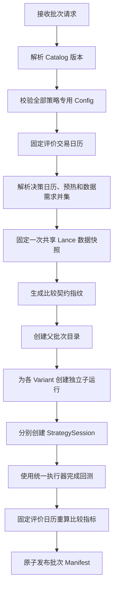

# 基金轮动完整策略热插拔与公平比较设计

**日期：** 2026-08-02  
**状态：** 设计已确认，待实施  
**实施边界：** `RESEARCH_ONLY`，不接入模拟盘、实盘或投资建议链路

## 1. 背景与设计结论

首版基金轮动把“相关距离、动态聚类、簇动量、簇内全部 ETF 等权”固化在公共 Pipeline 中。真实回测显示，一个簇可能包含超过 90% 的 ETF，最终目标组合同时持有上千只 ETF，产生大量最低佣金、容量阻塞和残余订单。

第二阶段不再把一个入选簇内的全部 ETF 等权买入。相关性聚类策略改为：在每个入选簇的中心附近候选中，选择流动性最好的一只 ETF 实现该簇风险暴露。

同时，公共框架不再把聚类作为所有基金轮动策略的前提。唯一的公共热插拔单位调整为完整的 `FundRotationStrategy`：

```text
公共 FundRotationBacktestRunner
└── 可插拔 FundRotationStrategy
    ├── correlation_all_members
    │   ├── 内部聚类器
    │   ├── 内部聚类质量门禁
    │   └── 内部代表 ETF 选择器
    ├── correlation_representative
    ├── simple_etf_momentum（未来可选，不使用聚类）
    └── risk_parity（未来可选，不使用聚类）
```

聚类器、聚类质量门禁和代表 ETF 选择器只属于相关性聚类策略的内部实现，不进入公共基金轮动策略接口。

## 2. 第一性原理边界

为了使不同策略的回测结果可以公平比较，公共框架必须统一控制：

- 固定版本的数据集和交易日历快照；
- PIT 可投资池、复权价格和收益缺失值语义；
- 正式绩效区间及信号到执行的时间关系；
- 初始资金、佣金、最低佣金、滑点、容量和交易单位；
- 订单、成交、估值、现金和持仓账本；
- 基准定义、指标计算和比较区间；
- 运行身份、代码版本、依赖版本和产物校验。

完整策略只负责：

- 声明所需数据、预热长度和策略专用配置；
- 生成自己的决策日历；
- 基于信号日及以前的数据生成目标权重决策；
- 输出策略专用诊断信息。

策略不得：

- 自行打开 Lance 最新版本或绕过固定数据快照；
- 修改公共 ETF 池资格规则；
- 访问信号日之后的数据；
- 修改执行费用、滑点、容量或估值规则；
- 直接调用执行器或自行计算最终绩效；
- 通过改变评价区间制造不可比收益。

“热插拔”指请求可以按受控策略 ID 选择完整策略，公共 Runner 无需修改。首版不支持 API 传入 Python 路径、上传脚本、运行时安装包或执行任意外部代码。

`RESEARCH_ONLY` 是强制运行模式，不只是免责声明：

- 请求中的模式只能是 `RESEARCH_ONLY`，其他值在创建任务前拒绝；
- 运行链路只能访问历史数据、模拟执行器和研究产物发布器；
- 不得实例化交易连接器、发送模拟盘或实盘订单、写入交易指令队列或生成自动投资建议；
- 批次、子运行、API 响应和 Manifest 都必须持久化 `mode=RESEARCH_ONLY`；
- 基金轮动服务不提供“发布到交易系统”动作，也不能注册为实时自动化交易任务的信号源。

## 3. 总体架构


公共 Runner 可以参考现有股票策略的 Catalog、Snapshot、Config、Runner 和批量比较模式，但不能复用股票策略的 `StrategyScore` 作为基金轮动输出。股票策略主要输出横截面评分，基金轮动策略直接输出组合目标权重事件。

## 4. 策略目录与专用配置

建议目录结构：

```text
backtest/fund_rotation/
├── catalog.py
├── contracts.py
└── strategies/
    ├── correlation_all_members/
    │   ├── strategy.py
    │   └── config.py
    └── correlation_representative/
        ├── strategy.py
        └── config.py
```

每个策略的 `config.py` 使用冻结的 Pydantic Model 声明：

- 参数类型和默认值；
- 数值范围和枚举选项；
- 跨字段约束；
- JSON 序列化规则；
- 供前端动态表单使用的 JSON Schema。

中央配置不再持续增加只对某个策略有效的字段。公共回测配置只保存策略快照、解析后的策略配置、研究区间、数据快照和执行规则。

相关性聚类策略的专用配置至少包含：

```text
k = 8
top_n = 3
correlation_lookback_weeks = 52
momentum_window_weeks = 4
recluster_interval_weeks = 26
min_valid_weeks = 20
min_pairwise_weeks = 20
representative_candidate_count = 5
representative_min_cluster_corr = 0.85
representative_liquidity_window_days = 20
representative_min_liquidity_observations = 15
max_cluster_share_warn = 0.50
max_cluster_share_reject = 0.80
min_effective_cluster_count_warn = 4.0
min_effective_cluster_count_reject = 2.5
```

聚类门禁的全部阈值都属于相关性聚类策略的冻结专用配置，不属于公共 Runner。补齐默认值后，它们进入 `resolved_config_hash`、策略快照和门禁诊断产物。配置校验必须保证最大簇占比的 warning 阈值严格小于 reject 阈值，并保证有效簇数量的 warning 阈值严格大于 reject 阈值。

简单动量或风险平价策略不需要出现任何聚类参数；未来其他策略可以在自己的 `config.py` 定义不同质量门禁，不要求复用聚类门禁字段。

## 5. 完整策略及会话契约

策略定义与单次运行会话分离：

```python
class FundRotationStrategy(Protocol):
    descriptor: FundRotationStrategyDescriptor
    config_model: type[BaseModel]

    def resolve_requirements(
        self,
        config: BaseModel,
    ) -> StrategyDataRequirements: ...

    def create_session(
        self,
        initialization: StrategyInitializationContext,
        config: BaseModel,
    ) -> FundRotationStrategySession: ...


class FundRotationStrategySession(Protocol):
    def scheduled_dates(
        self,
        calendar: tuple[str, ...],
        simulation_start_date: str,
        evaluation_end_date: str,
    ) -> tuple[str, ...]: ...

    def evaluate(
        self,
        context: StrategyDecisionContext,
    ) -> TargetWeightDecision: ...

    def finalize(self) -> StrategyDiagnostics: ...
```

每个子回测创建全新的 Session。聚类成员、上次重聚类日期、代表 ETF、备用候选及上次目标权重等运行状态只能保存在该 Session 中，不能进入全局策略单例。

策略描述符至少包含：

```text
id
name
description
interface_version
supported_universe
deterministic
```

描述符只保存不依赖本次参数的静态能力。配置校验后，策略必须通过纯函数式 `resolve_requirements(config)` 返回本次运行的 `warmup_trade_days`、`required_datasets` 和 `required_fields`。解析需求不得访问行情、当前时间或外部环境，并进入持久化解析结果和运行指纹。

## 6. 决策日历与因果数据视图

策略可以使用不同信号频率，例如日频、周频、月频或季度。父批次先按各 Variant 的 `resolved_requirements` 加载足够早的数据；`simulation_start_date` 表示该 Variant 已满足声明预热需求、可以开始产生决策的日期，不是原始数据加载起点。Runner 同时传入正式评价终点 `evaluation_end_date`。策略产生的决策日历必须：

- 严格递增且不重复；
- 位于公共预热起点至正式评价终点之间；
- 使用实际市场交易日；
- 不晚于数据快照可见日期；
- 在下一实际交易日开盘执行。

正式评价开始日前的决策只用于形成策略状态及确定首日目标，不产生评价期前的账本收益。正式评价结束日之后不再执行新订单。策略只能选择信号日期，不能改变正式绩效计分起点。

纯数据预热日期不得调用 `evaluate()`。策略必须从满足自身解析后预热需求的首个有效决策日开始排程；为获得评价开始日前最近一次有效目标，数据加载起点还必须早于所需的首个预评价决策日。预期的预热不足不能通过返回 `INVALID` 表示。

公共 Runner 不向策略暴露完整未来 DataFrame，而是构造以当前 `signal_date` 为上限的只读数据视图。该视图至少提供：

- 原始日线 OHLCV 和成交额；
- 复权收盘价；
- 日、周、月收益；
- 因果 ADV；
- 当时合格 ETF 及基金元数据；
- 当前信号日前的交易日历。

查询接口不接受任意 `end_date`，所有数据自动截断到当前信号日。收益计算显式使用：

```python
pct_change(fill_method=None)
```

不同策略不能自行选择是否对缺失价格前向填充。

因果数据视图使用受控的 `CausalDataView` 查询接口实现，而不是依赖 `__getattr__` 代理：

- `StrategyDecisionContext` 不包含原始 DataFrame、Lance Dataset、扫描器或底层数据句柄；
- 每个查询方法在读取前检查本 Variant 声明的数据集和字段白名单；
- 日期上界固化为当前 `signal_date`，策略不能传入任意未来 `end_date`；
- 返回值是不可变记录、只读数组或防御性副本，不能泄漏共享的可修改对象；
- 越权读取在返回数据前抛出 `UNDECLARED_STRATEGY_DATA_ACCESS` 并终止子运行。

这是一项对内注册策略的契约和测试边界，不把 Python 进程宣称为恶意代码安全沙箱。

策略可以看到 `previous_target_weights`，但不能看到实际成交、实际现金、未完成订单或实际滑点。这样市场信号不随资金规模和执行失败产生反馈；执行偏差继续由统一执行器归因。

## 7. 目标权重决策语义

标准决策必须区分：

```text
SET_TARGETS
HOLD_TARGETS
INVALID
```

### 7.1 SET_TARGETS

完整替换组合目标。空目标表示明确清仓并转为 100% 现金。聚类质量拒绝使用：

```json
{
  "action": "SET_TARGETS",
  "target_weights": {},
  "cash_weight": 1.0,
  "reason_code": "CLUSTER_QUALITY_REJECTED"
}
```

### 7.2 HOLD_TARGETS

本期不产生新目标事件，维持上一个目标。它不能被解释为清仓，也不能重新计算原订单数量。

Runner 在模拟开始时将当前目标初始化为 `{}`、现金权重初始化为 `1.0`。如果此前从未出现有效 `SET_TARGETS`，`HOLD_TARGETS` 表示继续持有 100% 现金。HOLD 不创建新目标事件、不调用订单管理器创建或替换订单，也不取消或重算已有残余订单；已有残余订单继续按原父订单和公共执行规则处理。

### 7.3 INVALID

策略发现因果历史不足、必要数据缺失或自身不变量被破坏。该结果终止子回测，不得静默保留旧目标。

一旦 Runner 按已解析预热契约调用 `evaluate()`，任何 `INVALID` 都终止该子运行，无论该决策日期位于正式评价区间之前还是之内。预热尚未完成时 Runner 不调用 `evaluate()`，因此不增加 `NOT_READY` 或“预热期跳过 INVALID”等第四种决策动作。

决策动作 `INVALID` 与研究质量字段 `quality_status=INVALID` 含义不同：前者表示策略无法继续并使子任务失败；聚类质量门禁拒绝则输出 `SET_TARGETS` 到现金并标记研究质量无效，子任务仍可成功生成诊断和净值。

标准 `TargetWeightDecision` 至少包含：

```text
decision_id
signal_date
action
target_weights
cash_weight
reason_code
quality_status
diagnostics
```

Runner 必须验证权重有限、非负、总和正确、代码属于当时合格 ETF 池、决策 ID 唯一且输出不依赖输入顺序。违规时使用 `STRATEGY_CONTRACT_VIOLATION` 终止运行。

## 8. 相关性聚类策略内部规则

相关性聚类策略内部执行：


### 8.1 中心与候选

使用与聚类相同的距离定义。簇中心使用实际 ETF 中的 medoid：

\[
medoid_c=\arg\min_{i\in c}\sum_{j\in c}d(i,j)
\]

从中心开始按距离由近到远选择 `M` 只候选，默认 `M=5` 且可配置。小簇不足 `M` 只时使用全部成员。

### 8.2 代表 ETF

候选首先通过信号日行情、复权因子和 ADV 历史完整性检查。随后计算信号日可见的 ADV20，在候选中选择 ADV20 最大者。

并列时依次使用：

1. 有效成交日更多；
2. 上市历史更长；
3. `ts_code` 字典序。

代表 ETF 必须与留一簇指数的相关系数不低于 `0.85`。不合格时按候选顺序检查下一只；全部候选不合格时该簇槽位保留现金。

代表 ETF 在每次重新聚类时锁定，并保持到下一次重新聚类。ADV 排名变化不触发切换。只有缺少有效行情、复权数据失效、行情记录显示连续零成交量或零成交额，或发生可确认的终止交易时，才按预先保存的备用顺序降级。替补判断不得读取本策略实际订单是否成交。

### 8.3 权重

Top-N 槽位各占 `1/Top-N`，不因合格簇或代表不足而放大其他槽位。三个槽位中只有两个可用时，两个代表 ETF 各占 `1/3`，其余 `1/3` 保留为现金。

## 9. 聚类质量门禁

每次重新聚类后计算簇成员占比：

\[
p_c=\frac{n_c}{N}
\]

并计算有效簇数量：

\[
N_{effective}=\exp\left(-\sum_{c=1}^{K}p_c\log p_c\right)
\]

默认规则：

| 指标 | 正常 | 警告 | 拒绝 |
|---|---:|---:|---:|
| 最大簇占比 | ≤ 50% | 50%–80% | > 80% |
| 有效簇数量 | ≥ 4.0 | 2.5–4.0 | < 2.5 |

表中四个边界分别来自 `max_cluster_share_warn`、`max_cluster_share_reject`、`min_effective_cluster_count_warn` 和 `min_effective_cluster_count_reject`，不得在策略实现中另写一套隐藏常量。

最大簇占比超过 80% 或有效簇数量低于 2.5 时，本次聚类周期拒绝所有风险资产目标并保持现金，不沿用上一周期的过期聚类结果。

Silhouette Score 首版作为诊断指标，不作为硬拒绝条件。门禁阈值必须在回测开始前确定，不能根据测试区间收益调整。

技术任务状态和研究质量分开记录：

```text
任务状态：SUCCEEDED / FAILED
研究质量：VALID / DEGRADED / INVALID
```

发生全局聚类质量拒绝的运行必须在收益页面显示研究无效警告，不能把净值作为有效策略结论。

## 10. 公共策略快照与运行身份

策略快照参考股票策略框架，至少保存：

- `strategy.py`；
- 对应 `config.py`；
- 策略声明的内部依赖模块；
- 各文件 SHA-256；
- 策略实现整体哈希；
- Git SHA 和工作区是否 dirty；
- Python 及 Pandas、NumPy、SciPy 版本；
- 补齐默认值并校验后的完整策略配置。

运行身份必须使用解析后的配置和策略实现哈希。省略默认值与显式填写相同默认值应产生相同指纹；策略实现变化后不能错误复用旧运行。

## 11. 公平比较

一次多策略比较必须先固定一份共享数据快照，再运行多个独立策略 Session。比较契约至少统一：

- 数据及交易日历版本；
- ETF 池规则版本；
- 收益缺失值规则版本；
- 正式评价区间；
- 初始资金、费用、容量和滑点；
- 基准及指标版本。

以上内容形成 `comparison_contract_fingerprint`。策略 ID、策略实现和策略专用参数不进入该指纹。

所有策略使用相同正式绩效区间。不能继续使用“策略首次实际成交日”作为各自的评价起点。门禁拒绝、无正信号或策略主动持有现金期间，现金收益也必须计入该正式区间。

多策略比较使用执行后净值作为主结果，理论目标收益单独展示。比较服务在批次固定的完整 `evaluation_calendar` 上重新计算收益、Sharpe 和回撤，不能直接拼接各自 `summary.json`，也不能对结果日期求交集。

## 12. 产物与前端

通用产物：

```text
resolved_spec.json
target_decisions.csv
targets.csv
equity.csv
orders.csv
trade_events.csv
positions.csv
metrics.json
summary.json
data_snapshot.json
manifest.json
```

策略通过逻辑 `StrategyArtifact` 声明专用诊断数据，不能自行写任意文件路径。相关性聚类策略可以输出：

```text
clusters.csv
cluster_quality.csv
cluster_representatives.csv
```

简单动量策略可以输出 `momentum_ranking.csv`，风险平价策略可以输出 `risk_contributions.csv`。Manifest 对每个产物记录逻辑角色、schema、生产策略、实现版本、校验和、行数和列名。

前端根据后端策略目录返回的 JSON Schema 动态生成策略专用表单。历史运行显示策略 ID、实现版本和研究质量。结果页根据产物角色展示策略专用页签，不再假设所有策略都有“聚类”页签。

## 13. 现有框架必须调整的区域

### 13.1 策略 Pipeline

`agent/backtest/fund_rotation/pipeline.py` 当前直接调用相关距离、Average-linkage、簇动量和簇内全成员等权。应将公共数据准备与策略目标生成分离，Pipeline 只调用完整策略 Session。

固定 K、完整距离矩阵和 `cluster_history` 不能继续作为公共 Pipeline 的不变量。

### 13.2 配置与服务

`agent/backtest/fund_rotation/config.py` 当前混合策略、研究和执行参数，应拆分为公共回测配置与策略专用配置。

`agent/src/stockpred/fund_rotation/service.py` 当前硬编码默认参数及固定 `run_signal_pipeline`，应改为通过策略 Catalog 解析策略、校验配置、创建快照并注入 Runner。

### 13.3 API 与前端

现有接口直接读取扁平 `params`，前端使用 `Record<string, number>`。新接口必须使用正式请求模型，支持策略 ID 和专用参数对象，并由后端返回配置 JSON Schema。

新接口迁移完成且现有调用方回归通过后，删除旧扁平接口，不保留两套长期运行模式。历史 v1 运行只需继续可读，不必伪装成支持新的公平比较契约。

### 13.4 状态机

顶层状态不应泄漏某一种算法。建议将 `PREPARING_RETURNS → CLUSTERING → GENERATING_TARGETS` 收敛为通用的 `PREPARING_DATA → GENERATING_SIGNALS`。聚类、门禁、代表选择等细分进度作为 `strategy_substage` 事件输出。

### 13.5 产物写入器

现有写入器固定要求 `cluster_history` 并固定生成当前 `clusters.csv`。应改为通用产物发布器加策略声明的诊断产物，同时保留现有 Manifest 白名单、checksum 和原子发布机制。

## 14. 验收测试

至少覆盖：

- 当前相关性聚类全成员等权行为封装成基线完整策略后，除第 32.1 节明确批准的公共正确性修复外，在合成数据上的目标和执行结果保持一致；
- 无聚类的假策略能够通过同一 Runner 产生目标并完成回测；
- 每个子运行拥有独立 Session，状态不会串扰；
- 未知策略 ID、非法专用参数和接口版本不兼容在任务启动前返回结构化错误；
- 策略不能读取信号日之后的数据；
- `SET_TARGETS`、`HOLD_TARGETS` 和 `INVALID` 语义不混淆；
- 空目标能够产生完整现金净值，而不是因为没有首笔成交而失去评价区间；
- 不同策略在共同数据快照、执行规则和正式区间上比较；
- 省略默认值与显式默认值产生相同运行指纹；
- 策略实现或配置文件变化后生成新的策略版本；
- 前端能够按不同策略 schema 渲染不同参数表单；
- 没有聚类产物的策略不会显示空的固定“聚类”页签；
- 相关性聚类策略的 medoid、候选距离、ADV20、门禁原因和最终代表全链路可追踪。

## 15. 已确认决策摘要

1. 完整 `FundRotationStrategy` 是唯一公共热插拔单位。
2. 聚类器、质量门禁和代表 ETF 选择器属于相关性聚类策略内部。
3. 每个策略使用自己的 `config.py` Pydantic Model。
4. 每个子回测创建独立、可持有内部状态的 Strategy Session。
5. 策略通过因果数据视图逐决策日输出标准目标权重决策。
6. 公共框架统一执行、费用、估值、基准和绩效。
7. 相关性聚类策略每个入选簇只交易一只中心附近且 ADV20 最好的代表 ETF。
8. 全局聚类门禁拒绝时保持现金，不沿用旧聚类结果。
9. 多策略比较固定共同数据快照和正式评价区间，不以首次成交日开始计分。
10. 首版继续保持 `RESEARCH_ONLY`。
11. 完整策略只通过服务启动时的显式白名单注册，不扫描目录或动态导入。
12. 策略专用配置使用冻结、禁止额外字段的 Pydantic Model，并向前端提供 JSON Schema。
13. 预热长度和数据字段由解析后的策略配置确定，批次对各 Variant 的需求取并集。
14. 单策略和多策略统一使用策略批次提交接口，不保留两套长期入口。
15. 同一批次共享不可变数据快照，但 Session、执行器、账户和产物完全隔离。
16. 运行及批次产物继续使用 JSON/CSV，不引入数据库。
17. 全部调用方迁移且回归通过后删除旧提交接口。
18. 历史 v1 运行继续只读，不强制迁移或重算。
19. 策略只能通过受控因果查询接口读取已声明数据，不能取得底层数据句柄。
20. 尚无目标时的 `HOLD_TARGETS` 维持现金，任何被调用后的 `INVALID` 都终止子运行。
21. 批次幂等键必填，同键同客户端请求返回原批次，同键不同请求返回 409。
22. 首版批次内 Variant 串行执行，父批次并发由部署级有界工作队列控制。
23. 首版不支持断点续跑；中断任务不发布批次 Manifest，完整重跑使用新幂等键。
24. 比较日期严格等于固定 `evaluation_calendar`，不能用结果日期交集缩短区间。
25. 新状态和事件使用版本化 schema，历史 v1 文件只读且不被改写。
26. 批次 SSE 使用父事件文件内全局递增序号，策略 substage 只用于展示。
27. 用户主动取消的父批次和当前子运行使用 `CANCELED`，服务异常中断使用 `FAILED_INTERRUPTED`；取消保留已原子发布的子产物，但不发布不完整的正式比较结果。

## 16. 策略 Catalog 与配置发现

### 16.1 注册方式

首版使用服务启动时的显式白名单注册：

```python
BUILTIN_STRATEGIES = (
    CorrelationAllMembersStrategy,
    CorrelationRepresentativeStrategy,
)
```

不扫描策略目录，不使用 Python Entry Point，不允许运行请求传入 Python 模块、类名或源文件路径。新增或修改策略后需要重新部署或重启服务，使实际加载的 Python 对象、Catalog 和源代码快照保持一致。

运行回测时可以按策略 ID 自由切换已注册策略。增加新策略只需要实现完整策略契约、专用配置并加入白名单，不修改公共 Runner。

### 16.2 运行时注册对象与持久化对象

内存中的注册对象：

```python
@dataclass(frozen=True)
class RegisteredFundRotationStrategy:
    descriptor: FundRotationStrategyDescriptor
    config_model: type[BaseModel]
    factory: Callable[[], FundRotationStrategy]
    implementation_snapshot: StrategyImplementationSnapshot
```

其中 `factory` 不能进入请求、运行指纹或 JSON 产物。

可持久化的解析结果：

```python
class ResolvedFundRotationStrategySpec(BaseModel):
    strategy_id: str
    interface_version: str
    implementation_hash: str
    config_schema_version: str
    config_schema_hash: str
    resolved_config: dict[str, JsonValue]
    resolved_config_hash: str
    resolved_requirements: StrategyDataRequirements
    resolved_requirements_hash: str
```

公共 Runner 同时接收内存中的策略实例和不可变的解析结果；它不能根据请求字符串动态 import 模块。

### 16.3 Catalog 契约

```python
class FundRotationStrategyCatalog:
    def list(self) -> tuple[StrategyCatalogEntry, ...]: ...

    def require(
        self,
        strategy_id: str,
    ) -> RegisteredFundRotationStrategy: ...

    def resolve(
        self,
        strategy_id: str,
        raw_params: Mapping[str, JsonValue],
    ) -> ResolvedStrategyBinding: ...
```

`resolve()` 必须：

1. 检查策略 ID；
2. 使用对应 `config_model` 校验参数；
3. 拒绝未知字段；
4. 补齐全部默认值；
5. 执行跨字段校验；
6. 输出规范化 JSON；
7. 计算配置 schema 和解析配置哈希；
8. 根据解析配置计算并校验本次数据需求及其哈希；
9. 绑定服务启动时固定的策略实现快照；
10. 返回绑定注册对象与解析结果的 `ResolvedStrategyBinding`。

Session 必须在共享数据快照固定、初始化上下文形成后由 Runner 创建；Catalog 解析阶段不得提前创建带运行状态的 Session。

错误使用：

```text
FUND_ROTATION_STRATEGY_NOT_FOUND
FUND_ROTATION_CONFIG_INVALID
FUND_ROTATION_INTERFACE_INCOMPATIBLE
FUND_ROTATION_DUPLICATE_STRATEGY_ID
FUND_ROTATION_STRATEGY_SNAPSHOT_INVALID
```

未知策略和配置错误必须在后台任务创建前返回结构化 `422`。

## 17. 策略配置文件契约

每个策略的 `config.py` 使用冻结、禁止额外字段的 Pydantic Model：

```python
class CorrelationClusterRotationConfig(BaseModel):
    model_config = ConfigDict(
        frozen=True,
        extra="forbid",
    )
```

要求：

- 所有默认值确定且可 JSON 序列化；
- 不使用当前时间、随机数或环境变量产生默认值；
- 不接受 callable、文件句柄或 Python 类型路径；
- 需要路径时由服务端部署配置解析，前端不能提交任意本地路径；
- 通过字段约束和 Model Validator 表达数值范围及跨字段规则。

配置规范化方式：

```python
validated = config_model.model_validate(raw_params)
resolved = validated.model_dump(
    mode="json",
    exclude_none=False,
    exclude_unset=False,
)
```

随后使用稳定排序 JSON 计算哈希。省略默认值和显式填写相同默认值必须产生同一个 `resolved_config_hash`。

## 18. 策略目录 API

```text
GET /stockpred/fund-rotation/strategies
GET /stockpred/fund-rotation/strategies/{strategy_id}
```

列表接口返回：

- Catalog 版本；
- 策略 ID、名称和说明；
- 策略接口版本和实现哈希；
- 默认配置解析出的预热长度、数据集和字段；
- 支持的 ETF 池类型。

详情接口额外返回：

- 参数 JSON Schema；
- 解析后的默认参数；
- 参数说明和研究用途警告；
- 策略声明的专用产物角色。

接口不返回本地绝对路径、源代码、Python factory 或模块路径。前端只提交策略 ID 和参数对象。

## 19. 策略与框架快照

基金轮动沿用现有股票策略的不可变源代码快照语义，并把底层哈希、路径安全和归档构造逻辑提取成共用工具；股票侧保留兼容适配器，不要求立即改变现有股票产物格式。

策略实现快照包含：

- 策略包目录中的全部 `.py` 文件；
- `strategy.py` 和 `config.py`；
- 策略描述符；
- 配置 JSON Schema；
- 各文件路径、内容和 SHA-256。

同一策略包内文件不依赖策略作者逐个声明，避免遗漏内部辅助模块。

公共框架另建实现快照，至少覆盖：

- `FundRotationBacktestRunner`；
- 策略契约和因果数据视图；
- ETF 池和收益计算规则；
- 执行器及 ETF 交易规则；
- 基准、指标和产物发布器。

因此运行身份同时保存：

```text
strategy_implementation_hash
framework_implementation_hash
```

Git SHA、工作区 dirty 状态、Python 和关键依赖版本作为额外审计信息，但不能替代策略与框架的内容哈希。

### 19.1 启动时固定快照

策略在服务启动时完成 import 后立即读取并固定源文件，构建只读 Catalog。不能在每次提交任务时重新读取磁盘源文件，否则可能出现内存中执行旧代码、快照却记录新文件的错配。

服务运行期间磁盘文件变化不改变当前 Catalog 和实现哈希。新增或修改策略后必须重启服务。

### 19.2 版本层次

| 字段 | 含义 |
|---|---|
| `interface_version` | 策略与 Runner 的接口契约 |
| `implementation_hash` | 策略源文件、配置 schema 和描述符的内容哈希 |
| `resolved_config_hash` | 本次补齐默认值后的实际配置哈希 |

可以提供人工可读版本，但幂等、复现和比较使用内容哈希。

完整运行指纹包含：

```text
策略实现
解析后的策略配置
公共框架实现
数据快照
研究契约
执行契约
```

公平比较指纹排除策略实现和策略专用配置，保留公共框架、数据快照、正式评价区间、ETF 池规则、执行、基准和指标版本。

## 20. 策略随机性

默认要求策略确定性运行。如果策略确需随机算法：

- `config.py` 必须显式提供 `random_seed`；
- 不允许使用系统时间作为默认 seed；
- seed 进入解析配置哈希；
- Session 使用自己的随机数生成器；
- 不修改全局 NumPy 随机状态；
- 产物记录实际 seed；
- 相同快照、实现和配置必须生成相同目标事件。

## 21. 统一策略批次提交

单策略和多策略不维护两套提交接口。统一使用策略批次：一个 Variant 是普通回测，多个 Variant 自动产生公平比较结果。

```text
POST /stockpred/fund-rotation/strategy-batches
```

请求包含：

- schema 版本和幂等键；
- 一份共享研究配置；
- 一份共享执行配置；
- 一个或多个策略 Variant。

每个 Variant 包含 `strategy_id`、可选展示标签和策略专用参数。服务使用解析配置哈希生成稳定的：

```text
variant_key = strategy_id + "@" + resolved_config_hash 前 12 位
```

同一个策略可以在一个批次使用多组参数；相同策略实现和相同解析配置不能重复出现。展示标签不参与策略逻辑和运行身份。

### 21.1 幂等键契约

`idempotency_key` 是批次创建的必填字段，作用域为当前 StockPred 研究工作区下的基金轮动批次：

- 首次请求原子地把该键绑定到规范化客户端请求和 `batch_id`，返回 `202`；
- 相同键与相同规范化客户端请求返回已有批次及其当前状态，返回 `200`，不得启动新任务；
- 相同键与不同请求返回 `409 IDEMPOTENCY_CONFLICT`；
- 失败或中断的批次不会因重复提交相同键自动重跑，完整重跑必须使用新键；
- 并发提交相同键时只能有一个请求成功创建目录，不能依赖“先检查文件、后创建目录”的非原子流程。

幂等比较使用 `schema_version` 加规范化客户端 payload 的稳定 JSON 哈希，规范化只做 JSON 类型、对象键排序和已声明的请求别名处理，不在服务升级后重新解析旧策略默认值。解析后的策略、配置、实现和框架哈希另存为 `resolved_batch_identity`；幂等身份与运行复现身份不能混为同一个哈希。这样服务升级后重复原请求仍返回原批次，而不会用新代码静默创建不同结果。

## 22. 批次创建流程



所有策略 ID 和专用参数在创建后台任务前完成校验。数据快照失败属于父批次失败，不创建不完整子运行。

## 23. 共同数据需求与访问范围

父批次计算：

```text
required_datasets = union(所有 Variant resolved_requirements.required_datasets)
required_fields = union(所有 Variant resolved_requirements.required_fields)
warmup_trade_days = max(所有 Variant resolved_requirements.warmup_trade_days)
```

这里使用的全部字段都来自每个 Variant 在配置校验后生成的 `resolved_requirements`，不是描述符中的固定常量。配置改变回看窗口时，预热长度和数据需求必须随之重新解析并进入运行指纹。

交易日历先固定用于解析决策日期，随后一次性固定所需 Lance 数据版本；两者共同进入数据快照。所有子运行引用同一个 `data_snapshot_fingerprint`。

数据起点不能简单写成“评价开始日减去公共最大预热”。父批次先固定交易日历，各策略基于该日历确定为了评价首日目标而需要的最近一个预评价决策日，再从该决策日向前满足自己的 `warmup_trade_days`。父批次取所有 Variant 所需数据起点的最早值，并固定一次 Lance 快照。这样预热数据、预评价目标和正式评价区间之间没有循环依赖，也不会把纯预热日期误当成决策日。

具体采用两步解析，避免 `simulation_start_date` 与预评价决策日循环依赖：

1. 先固定交易日历和 Lance 版本标识，但尚不扫描或物化行情行；
2. 对每个 Variant，从完整固定日历中以“最早可用交易日向后满足自身 `warmup_trade_days`”得到临时下界，创建尚未执行 `evaluate()` 的 Session，并调用 `scheduled_dates(calendar, provisional_start, evaluation_end_date)`；
3. 在返回日历中找到评价开始日前最近一个可形成首日目标的决策日；若不存在，Variant 在任务启动前以数据历史不足失败；
4. 从该预评价决策日按交易日历向前回溯自身 `warmup_trade_days`，得到该 Variant 的真实数据起点和 `simulation_start_date`；
5. 父批次取全部真实数据起点的最早值，从步骤 1 已固定的 Lance 版本一次性读取共享数据；随后各 Session 仅从自己的 `simulation_start_date` 开始调用 `evaluate()`。

步骤 2 的 Session 只能计算纯日历排程，不得读取行情或形成决策；步骤 5 才注入 `CausalDataView`。策略的排程结果必须只依赖解析配置和输入日历，同一输入重复调用完全一致。

每个策略的因果数据视图只暴露该策略描述符已声明的数据能力。访问未声明数据时使用 `UNDECLARED_STRATEGY_DATA_ACCESS` 终止子运行。

## 24. 正式评价区间与初始建仓

正式评价日期是请求开始和结束日期之间的全部实际市场交易日。所有策略使用相同评价日期，不能以各自首笔成交日作为起点。

策略从公共最大预热起点开始生成内部状态和历史决策。评价区间开始前的决策不产生账本收益；保存开始日前最后一个有效 `SET_TARGETS`，并在评价区间第一个交易日开盘按该目标建仓，正常收取佣金、滑点和容量成本。指标从建仓前的初始 `NAV=1.0` 计算。

如果策略在开始日前没有有效目标，则从现金开始。这样不同信号频率具有共同计分区间，同时不会无成本继承回测前持仓。

## 25. 子运行隔离

每个 Variant 必须拥有独立的：

- Strategy Session；
- 目标序列；
- 执行器和订单管理器；
- 持仓、现金和净值；
- 策略快照和解析配置；
- 随机数生成器；
- 子运行目录及 Manifest。

子运行只共享不可变数据快照、正式评价日历、公共研究契约、执行配置和基准定义。禁止共享可修改 DataFrame、策略状态、目标、持仓或残余订单。

### 25.1 首版资源与并发模型

首版在一个父批次内按稳定的 `variant_key` 顺序串行执行 Variant，不使用 Variant 级线程池或进程池。服务使用部署级有界工作队列限制同时运行的父批次数，默认并发批次数为 1；该 worker 数属于运行资源配置，不是策略参数，也不进入比较指纹。

父批次只解析和固定一次数据快照、交易日历及可安全复用的规范化只读数据。共享缓存只能通过 `CausalDataView` 访问；Session、目标、执行上下文、账户、订单和产物仍逐 Variant 独立创建。不得在线程间共享 Lance 扫描器或可修改 Pandas 对象。

以后只有在 1、3、10 个 Variant 的墙钟时间和峰值 RSS 基准完成、证明资源上限可控后，才能启用有界并行。并行实现必须为每个 worker 创建独立数据读取句柄，并通过现有确定性回归证明执行调度不改变结果。

## 26. 批次状态与失败隔离

父批次状态：

```text
QUEUED
→ VALIDATING
→ SNAPSHOTTING_DATA
→ RUNNING_STRATEGIES
→ COMPARING
→ WRITING_RESULTS
→ SUCCEEDED | PARTIAL_SUCCEEDED | FAILED | CANCELED | FAILED_INTERRUPTED
```

子运行状态：

```text
QUEUED
→ PREPARING_DATA
→ GENERATING_SIGNALS
→ EXECUTING
→ COMPUTING_METRICS
→ WRITING_RESULTS
→ SUCCEEDED | FAILED | CANCELED | FAILED_INTERRUPTED
```

父批次状态语义：

| 状态 | 含义 |
|---|---|
| `SUCCEEDED` | 全部子运行成功 |
| `PARTIAL_SUCCEEDED` | 批次正常运行至结束，至少一个子运行成功且至少一个子运行失败；不用于服务中断 |
| `FAILED` | 父级数据准备失败，或全部子运行失败 |
| `CANCELED` | 用户主动取消；任务在最近的安全检查点停止，已原子发布的子运行产物保持只读，不生成或更新未完成的正式比较结果 |
| `FAILED_INTERRUPTED` | 服务中断且不能自动恢复 |

一个策略失败不取消其他策略。只有至少两个成功且比较契约一致的 Variant 才生成正式策略比较。失败策略不能按零收益进入排名。

### 26.1 中断检测与重新运行

首版不支持子运行内部断点续跑，也不复用另一个批次已经完成的子运行：

1. 服务启动时扫描没有终态的父批次和子运行；
2. 已原子发布成功 Manifest 的子运行保持不可变并可单独只读；
3. 仍处于非终态的子运行标记为 `FAILED_INTERRUPTED`；
4. 只要父批次没有发布成功 Manifest 且执行过程被中断，父批次标记为 `FAILED_INTERRUPTED`，不能把已有部分子产物伪装成正式比较结果；
5. 临时文件和未发布目录不得参与读取、排名或比较；
6. 重新运行整个批次必须使用新的幂等键并重新执行全部 Variant。

安全取消和中断的价值在于停止继续消耗资源、阻止半成品发布、保留已经原子发布的审计产物，并给出明确终态；它不承诺从计算断点恢复。

用户取消与服务中断必须区分：用户取消使用 `CANCELED`，进程或服务异常中断使用 `FAILED_INTERRUPTED`。取消请求只设置取消令牌；Runner 在决策日、执行日和产物发布边界检查令牌。尚未开始的 Variant 不再启动，正在运行的子任务在最近安全检查点转为 `CANCELED`；已经 `SUCCEEDED` 的子运行不得改写。父批次一旦接受取消请求，最终状态为 `CANCELED`，即使此前已有成功子运行；这些成功产物仍可单独只读，但不得伪装为完整批次比较结果。

## 27. 公平比较指纹与指标

```text
comparison_contract_fingerprint = hash(
    framework_implementation_hash
  + data_snapshot_fingerprint
  + evaluation_calendar_hash
  + universe_policy_version
  + return_policy_version
  + execution_contract
  + benchmark_contract_version
  + metric_contract_version
)
```

比较指纹不包含策略 ID、策略实现、策略专用参数或展示标签。

服务只在批次创建时固定的完整 `evaluation_calendar` 上重新计算：

- 总收益、年化收益和年化波动；
- Sharpe、Sortino、最大回撤和 Calmar；
- 换手、佣金和滑点成本；
- 执行失败现金和失败订单比例；
- 平均和最大持仓数量。

不能直接拼接各子运行 `summary.json`。比较主结果使用执行后净值，理论目标组合收益单独展示。

所有参与比较的技术成功子运行及基准，其净值索引必须严格等于 `evaluation_calendar`。缺少任一正式评价日属于子运行或比较契约错误，不能通过日期交集静默缩短区间。`action=INVALID` 终止并标记失败的子运行不参与比较日期计算；`quality_status=INVALID` 但技术成功的子运行仍必须输出覆盖完整评价日历的现金或执行净值，只是不进入默认排名。

研究质量状态分为 `VALID / DEGRADED / INVALID / FAILED`。默认排名只纳入 `VALID` 和 `DEGRADED`；`INVALID` 保留净值和诊断，但不进入策略排名。

## 28. 批次与子运行 API

```text
GET  /stockpred/fund-rotation/strategies
GET  /stockpred/fund-rotation/strategies/{strategy_id}

POST /stockpred/fund-rotation/strategy-batches
GET  /stockpred/fund-rotation/strategy-batches
GET  /stockpred/fund-rotation/strategy-batches/{batch_id}
POST /stockpred/fund-rotation/strategy-batches/{batch_id}/cancel
GET  /stockpred/fund-rotation/strategy-batches/{batch_id}/events
GET  /stockpred/fund-rotation/strategy-batches/{batch_id}/artifacts/{artifact_id}

GET  /stockpred/fund-rotation/backtests/{run_id}
GET  /stockpred/fund-rotation/backtests/{run_id}/artifacts/{artifact_id}
GET  /stockpred/fund-rotation/backtests/{run_id}/instruments/{ts_code}/chart
```

`backtests` 仅作为子运行读取接口，不再提供长期独立提交入口。完成前端和全部调用方迁移、回归测试通过后删除旧的：

```text
POST /stockpred/fund-rotation/backtests
```

## 29. 批次文件持久化

继续使用 JSON 和 CSV，不引入数据库：

```text
agent/runs/fund_rotation/
├── strategy_batches/
│   └── {batch_id}/
│       ├── request.json
│       ├── resolved_batch.json
│       ├── state.json
│       ├── events.jsonl
│       ├── data_snapshot.json
│       ├── reports.json
│       ├── comparison_equity.csv
│       ├── comparison_metrics.csv
│       └── manifest.json
└── {run_id}/
    ├── resolved_spec.json
    ├── strategy_snapshot.json
    ├── target_decisions.csv
    ├── targets.csv
    ├── equity.csv
    ├── metrics.json
    └── ...
```

父批次只保存子运行 ID 引用，不复制子运行产物。父批次 Manifest 最后原子写入；没有成功 Manifest 的目录不能作为完整比较结果发布。

## 30. 前端批次交互

参数区分为：

1. 公共研究和执行条件；
2. 一个或多个策略 Variant 卡片；
3. 回测提交与进度。

每个 Variant 卡片显示策略选择、展示标签、实现版本及根据 JSON Schema 生成的专用参数，并支持复制或删除。至少保留一个 Variant。

比较结果显示执行净值叠加、收益风险表、成本和可交易性表、研究质量状态、数据快照和比较契约指纹，以及各子策略诊断入口。页签根据策略产物角色动态生成。

### 30.1 批次事件契约

批次 `events.jsonl` 与 SSE 使用同一个版本化事件模型：

```json
{
  "schema_version": "v2",
  "seq": 123,
  "event_type": "VARIANT_PROGRESS",
  "scope": "VARIANT",
  "ts": "2026-08-02T12:00:00+08:00",
  "batch_id": "...",
  "run_id": "...",
  "variant_key": "...",
  "strategy_id": "...",
  "stage": "GENERATING_SIGNALS",
  "strategy_substage": "RECLUSTERING",
  "progress": {
    "completed": 12,
    "total": 81,
    "unit": "decision_dates",
    "ratio": 0.148148
  },
  "message": null,
  "error": null
}
```

约束如下：

- `event_type` 至少支持 `BATCH_STAGE`、`VARIANT_STAGE`、`VARIANT_PROGRESS`、`TERMINAL` 和 `ERROR`；
- `scope` 为 `BATCH` 或 `VARIANT`，Variant 事件必须包含 `run_id`、`variant_key` 和 `strategy_id`；
- `seq` 在父批次事件文件内全局严格递增，不能使用各子运行自己的局部序号；
- `Last-Event-ID` 只对应父批次全局 `seq`，断线重连不得漏掉其他 Variant 的事件；
- 事件必须先原子追加或持久化，再通过 SSE 发出；
- `completed` 和 `total` 是非负整数，`completed <= total`，同一任务同一 unit 的进度不得倒退，`ratio` 由两者计算；
- `stage` 使用公共父批次或子运行状态枚举；`strategy_substage` 是策略命名空间内的非稳定展示字符串，不能驱动公共状态机；
- 前端对未知 `event_type`、`stage` 或 `strategy_substage` 必须安全降级为原文展示或忽略扩展字段。

子运行可以保留自己的局部事件文件用于诊断，但聚合到父批次时必须由父事件发布器分配新的全局 `seq`。

## 31. 迁移原则

从基本约束重新推导：

1. 当前固定流程必须先成为一个可回归验证的基准策略；
2. 插件化不能顺带改变执行器、费用、交易单位等已经确认的语义；
3. 开发期间可以并存新旧实现用于内部对照，但不能向用户暴露两种运行模式；
4. 全部调用方切换并验证后，删除旧提交接口和旧固定流程；
5. 历史回测结果继续只读，不强制迁移。

因此采用“内部短期双轨验证，最终单入口切换”，不长期兼容两套提交接口。

## 32. 分阶段迁移

### 32.1 阶段 0：修正比较基础

先修复会影响所有策略可信度的问题：

- 收益率使用 `pct_change(fill_method=None)`；
- 固定数据版本、交易日历版本和基金池快照；
- 修正 52 周训练窗口边界问题；
- 评价区间从统一的 `evaluation_start` 开始，不再依赖第一次实际成交；
- 区间开始前最近一次 `SET_TARGETS` 在评价首日开盘执行；
- 始终持有现金、无成交、全部订单受阻也必须能正常生成净值和指标；
- 净值统一从交易前的 `1.0` 开始。

这些是比较平台的公共正确性要求，不属于任何具体轮动策略。

“52 周相关窗口”的精确定义为：截至信号周收盘、包含信号周在内的最近恰好 52 个有效周收益观察，不包含信号周之后的数据。周收益由相邻两个有效周末复权收盘价计算，因此首次形成 52 个周收益至少需要 53 个有效周末价格；由缺少前序价格产生的首行全空收益不计入 52 个观察。

当前实现的边界问题是：长度检查允许 52 行周收益索引通过，但 `range(min_weeks_needed, len(all_weeks))` 不产生决策；后续 `iloc[week_idx-lookback:week_idx+1]` 在首个决策又取得 53 行。修复后必须满足：

- 52 个周末价格不能形成完整的 52 周收益窗口；
- 53 个连续有效周末价格恰好形成 52 个周收益；
- 第 53 个周末收盘后可以产生首个使用完整窗口的信号；
- 实际送入相关性计算的窗口索引恰好包含 52 个周收益日期；个别 ETF 的缺失值继续由 `min_valid_weeks` 和 `min_pairwise_weeks` 门禁处理；
- 窗口不足时明确不调仓或按契约失败，不能通过多取一行掩盖边界。

### 32.2 阶段 1：建立策略契约与目录

增加最小公共模块：

```text
agent/backtest/fund_rotation/
├── contracts.py
├── catalog.py
├── causal_data.py
├── runner.py
├── comparison.py
└── strategies/
    ├── correlation_all_members/
    │   ├── config.py
    │   └── strategy.py
    └── correlation_representative/
        ├── config.py
        └── strategy.py
```

其中：

- `correlation_all_members` 封装当前“入选簇内全部 ETF 等权”的行为，作为迁移基准；
- `correlation_representative` 实现新确认的“簇中心附近候选中选择流动性最佳 ETF”；
- 两者都实现同一个 `FundRotationStrategy` 契约；
- 公共 Runner 不知道策略是否使用聚类。

暂时不拆出更多公共抽象，避免为尚不存在的策略提前设计框架。

旧 `FundRotationConfig` dataclass 只允许通过单向临时适配器进入基准策略：

```text
旧扁平请求 → legacy adapter → 新公共回测配置 + 基准策略 Pydantic Config
```

新 Runner、策略和执行模块禁止同时接受 dataclass 与 Pydantic 两套配置类型。迁移顺序为测试与基准适配、Pipeline、Service/API、前端调用方；全部调用方清零后删除 legacy adapter 和旧 dataclass。适配器只用于内部迁移验证，不构成用户可选择的第二种运行模式。

### 32.3 阶段 2：提取公共 Runner

从现有固定 Pipeline 中提取：

- 数据加载和 PIT 裁剪；
- 调仓日驱动；
- 策略 Session 生命周期；
- 目标权重决策处理；
- 通用执行器调用；
- 净值与指标计算；
- 通用产物写入。

现有通用目标权重执行器和 ETF 专用成交规则保持不变，Runner 只负责向执行器提交目标权重。

当前固定 Pipeline 中的 `_build_execution_context`、`_run_execution_loop`、`_execute_with_capacity`、`_mark_to_market`，以及残余订单处理、复权份额调整和账户净值构造，都必须迁移到公共 Runner 或公共执行模块并由其唯一调用。任何策略插件都不能持有可修改账户对象或直接调用这些函数。

随后让基准策略通过新 Runner 运行，并与修正后的旧流程做逐调仓日对照。

### 32.4 阶段 3：接入新代表 ETF 策略

实现相关性聚类策略内部的：

- 聚类；
- 聚类质量门禁；
- medoid 计算；
- 距中心最近的可配置候选数量；
- ADV20 流动性选择；
- 代表 ETF 锁定；
- 硬失效替补；
- 策略专用诊断产物。

这些组件保留为策略内部实现，不进入公共插件协议。

### 32.5 阶段 4：批次服务与持久化

接入统一批次接口：

```text
POST /stockpred/fund-rotation/strategy-batches
```

实现：

- 批次级共享不可变数据快照；
- 多策略独立 Session 和执行状态；
- 父批次与子任务状态；
- JSON/CSV 原子写入；
- 公共区间指标重算；
- comparison fingerprint；
- 部分成功与失败隔离。

### 32.6 阶段 5：前端迁移

前端改为：

- 从策略目录接口读取策略列表和 JSON Schema；
- 动态渲染策略专用参数；
- 单策略也按单 Variant 批次提交；
- 多策略展示横向比较；
- K 线图通过标准成交和目标持仓产物展示买卖点；
- 策略专用诊断结果使用扩展产物展示。

现有基金轮动平铺参数表单不再作为长期兼容入口。

### 32.7 阶段 6：切换和清理

满足验收门禁后一次性完成：

1. 更新所有旧调用方；
2. 正式流量切换至新 Runner；
3. 删除旧的基金轮动提交接口；
4. 删除旧平铺配置转换逻辑；
5. 删除公共流程对具体聚类函数的直接引用；
6. 保留历史运行结果的只读解析能力。

基准策略仍可保留，因为它是一个正常的策略插件和研究对照组，不是旧运行模式。

## 33. 兼容边界

### 33.1 继续兼容

- 已有历史运行目录和读取接口；
- 已生成的净值、订单、成交及 K 线标记；
- 通用目标权重执行器；
- ETF 费用、100 份交易单位、ADV20 容量约束；
- StockPred 现有数据读取方式。

历史运行无需重算或重写，只在读取层按其原有产物版本解析。

历史状态和事件采用版本分派读取：

- 新的 `state.json` 和 `events.jsonl` 分别写入 `state_schema_version` 与 `event_schema_version`；
- 没有版本字段的现有运行按 v1 解析，保留 `PREPARING_RETURNS`、`CLUSTERING`、`GENERATING_TARGETS` 等旧 token；
- 读取层可以把旧 token 映射为新 UI 展示阶段，但不能把映射结果写回历史文件；
- 中断检测同时识别 v1 与 v2 非终态，部署时遗留的旧任务不能因枚举删除而漏检；
- 历史 SSE 时间线、运行详情和 K 线读取必须继续支持 v1，公共 v2 状态机不要求旧事件满足新转换图。

### 33.2 不长期兼容

- 旧基金轮动提交接口；
- 固定聚类 Pipeline；
- 公共服务中的平铺策略参数；
- 前端硬编码的 `Record<string, number>` 参数模型；
- 依赖第一次成交确定评价起点的指标口径。

## 34. 测试矩阵

| 测试组 | 核心验证 |
|---|---|
| 数据因果性 | 修改未来数据不会改变过去任何决策 |
| 因果访问能力 | 策略无法取得底层数据句柄，未声明字段和越过信号日的访问在返回数据前失败 |
| 数据快照 | 同一批次所有子策略的数据版本、日历和基金池完全一致 |
| 策略契约 | 非法决策、非法权重、未知策略及非法配置被明确拒绝 |
| 决策边界 | 首次 HOLD 维持现金且不替换残余订单；满足预热前不调用 evaluate；调用后的 INVALID 一律失败 |
| 52 周窗口 | 53 个有效周末价格产生首个包含恰好 52 个收益日期的相关窗口，少一个时不产生完整信号 |
| 基准回归 | 基准策略在已声明修正项之外，与原固定流程逐日一致 |
| 聚类门禁 | 90% 集中于单簇等退化结果触发拒绝并持有现金 |
| 代表 ETF | 每个入选簇最多产生一个目标 ETF，选择依据可追溯 |
| 执行器 | 手数、费用、先卖后买、共同缩放及受阻原因正确 |
| 无成交场景 | 始终现金和全部订单受阻也能输出完整指标 |
| 公平比较 | 成功策略净值索引严格等于固定评价日历，缺日失败且不得求交集缩短 |
| 持久化 | 中断时不发布半成品清单；无断点续跑；已发布子产物保持只读 |
| 取消 | 主动取消进入 CANCELED、异常中断进入 FAILED_INTERRUPTED；未开始 Variant 不启动，已成功子运行不改写，父批次不发布不完整比较 |
| 幂等 | 同键同请求返回原批次、不同请求 409、并发创建只有一个成功占位 |
| API | 单策略和多策略使用同一批次契约 |
| 事件 | 父批次 seq 全局递增，SSE 断线续接不漏 Variant，未知 substage 安全降级 |
| 前端 | 参数 Schema、错误定位、比较结果和 K 线买卖点正确 |
| 历史兼容 | 现有 `bac86bdddcf85601` 及 v1 state/events/K 线仍可读取且不被改写 |
| 资源基线 | 记录 1、3、10 个 Variant 的墙钟时间、峰值 RSS 和共享数据缓存规模 |

## 35. 关键验收门禁

迁移完成必须同时满足：

1. 新增一个完全不使用聚类的轮动策略时，不需要修改 Runner、服务路由和前端表单代码；
2. 同一批次中的策略具有完全相同的 comparison fingerprint；
3. 固定输入重复运行时，除运行 ID、创建时间等非确定字段外，离散规范化产物完全一致，浮点字段满足第 35.1 节容差；
4. 基准策略的新旧结果差异只能来自已明确批准的正确性修复；
5. 修改某个决策日之后的数据，不会改变该决策日及以前的决策；修改当时已可见的历史输入可能改变后续决策，这是预期行为；
6. 全现金策略的净值从 `1.0` 开始，收益为零，指标计算不崩溃；
7. 新代表 ETF 策略中，每个入选簇最多持有一只 ETF；
8. 被质量门禁拒绝的调仓明确记录原因，不能静默沿用错误目标；
9. 全部前后端调用方迁移后，旧提交接口才能删除；
10. 旧历史运行仍能被详情页和 K 线图读取。

目标持仓数量、受阻订单比例、换手率和收益改善属于研究结果的经验验收指标，不作为框架正确性的单元测试门禁。

### 35.1 基准迁移回归精度

逐调仓日和逐执行日比较按字段类型验收，不能使用一个宽松的全局容差：

| 字段类别 | 验收标准 |
|---|---|
| 日期、代码、动作、原因码、订单方向、状态、簇标签 | 完全一致 |
| 整数份额、订单数量、持仓数量 | 完全一致 |
| 目标权重 | `rtol=0, atol=1e-12` |
| 成交价格、佣金、现金和权益金额 | `rtol=1e-12, atol=1e-6 CNY` |
| 归一化 NAV | `rtol=1e-10, atol=1e-10` |
| 收益风险指标 | `rtol=1e-9, atol=1e-10` |

第 32.1 节的 52 周边界、显式缺失值语义、统一评价起点和初始 `NAV=1.0` 等已批准正确性修复，必须使用逐项 `golden_delta` 白名单记录预期变化。不得通过放宽浮点容差接受交易日期、交易方向、订单状态或份额变化。

### 35.2 资源验收

实施前先以固定数据快照建立 1 个 Variant 基线，再测量 3 个和 10 个 Variant。至少记录总墙钟时间、各阶段耗时、峰值 RSS、规范化数据缓存规模和每个决策日平均耗时。首版不在没有测量的情况下承诺绝对秒数或内存数值，但必须满足：

- 不创建无界线程或进程；
- 批次内默认串行执行；
- 3 个和 10 个 Variant 不因重复复制完整行情而呈近似线性内存膨胀；
- 长时间运行持续持久化阶段及决策日进度；
- 性能优化前后通过完全相同的确定性和公平比较测试。

## 36. 回退策略

正式切换前，新旧流程只在测试环境内部对照，不提供模式开关。

正式切换采用单次提交完成：

- 切换统一入口；
- 更新全部调用方；
- 删除旧入口。

如果上线后发现框架问题，回退代码提交即可。批次目录是追加式 JSON/CSV 产物，不修改历史数据，因此不需要数据库回滚或产物迁移。
