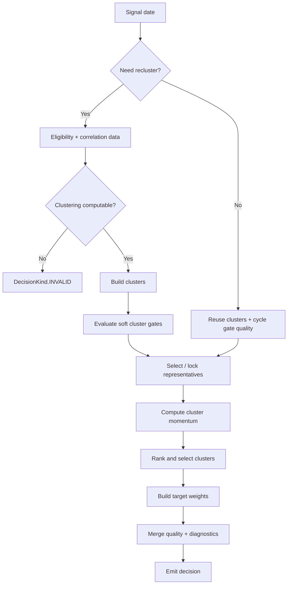

# 基金轮动 Soft Cluster Quality Gate 设计

## 状态与范围

- Status: Proposed
- Target strategy: `correlation_representative`
- Priority: P1
- Motivation: run `485f5df3be8a` 中聚类质量门禁导致 234/234 决策被强制切为现金
- Compatibility: 行为语义变更；配置字段与阈值保持兼容；诊断字段以增量方式扩展

本设计只处理聚类结构质量门禁的职责边界：

1. `MAX_CLUSTER_SHARE` / `EFFECTIVE_CLUSTER_COUNT` 改为 soft quality gate。
2. 删除 `cluster imbalance -> SET_TARGETS {} -> cash_weight=1.0` 的执行路径。
3. 聚类结构异常时将研究质量标记为 `DEGRADED`，但继续 representative selection、momentum ranking 和 target construction。
4. 保留真正“无法计算策略”的 hard-invalid 路径。

本设计**不处理** PIT universe / fund master 接线、ETF 暴露去重、tracking index、聚类算法、阈值调参、代表 ETF 参数或动量参数。这些问题必须独立验证，避免通过同一改动同时改变数据边界、策略含义和执行语义。

## 背景

当前 `correlation_representative` 在每次重聚类后计算两个结构质量指标：

- `MAX_CLUSTER_SHARE = max(n_c / N)`；
- `EFFECTIVE_CLUSTER_COUNT = exp(-Σ p_c ln p_c)`。

当前配置为：

| Gate | WARN | REJECT |
|---|---:|---:|
| `MAX_CLUSTER_SHARE` | `0.50` | `0.80` |
| `EFFECTIVE_CLUSTER_COUNT` | `4.0` | `2.5` |

当任一 gate 进入 `REJECT` 时，当前实现会：

1. 设置 `_cycle_rejected=True`；
2. 清空 `_representatives`；
3. 返回 `SET_TARGETS`，`target_weights={}`，`cash_weight=1.0`；
4. 设置 `reason_code=CLUSTER_QUALITY_REJECTED`；
5. 设置 `quality_status=INVALID`；
6. 在整个重聚类周期内持续强制现金，直到下一次重聚类。

这使一个“聚类结构是否理想”的研究质量判断直接拥有了“清仓”的投资决策权。

以 run `485f5df3be8a` 为例，首期最大簇占比约 `0.8963`，有效簇数量约 `1.6708`，于是整个周期被判 `REJECT`；最终 234/234 决策均为 `CLUSTER_QUALITY_REJECTED`，没有进入代表 ETF 和动量选择形成有效目标仓位。

## 问题定义

### 1. 结构不均衡不等于算法不可计算

相关性聚类的目标是描述收益序列的相似结构，而不是制造成员数量均衡的簇。若市场中的 ETF 大量共享同一权益 beta，大簇可能是数据本身的真实结构，而不必然意味着聚类计算失败。

`MAX_CLUSTER_SHARE` 和 `EFFECTIVE_CLUSTER_COUNT` 能回答：

> 当前聚类结果的集中度是否过高，结构分辨率是否较弱？

它们不能直接回答：

> 当前是否应当把组合全部变成现金？

因此二者属于 research-quality / confidence signal，而不是 portfolio-action signal。

### 2. 当前实现混淆三种状态

必须明确区分：

1. **Calculation validity**：输入是否足以计算相关性、距离矩阵和聚类。
2. **Research quality**：计算结果是否具有理想的结构分辨率和解释力。
3. **Portfolio action**：根据代表 ETF、动量和可交易性最终应持有哪些资产。

当前实现把第 2 类问题直接映射为第 3 类动作，并进一步将其标为 `INVALID`，导致质量控制越权改变策略本身。

## 设计原则

### 原则 A：质量状态不能隐式改写交易动作

cluster quality gate 只能影响：

- `quality_status`；
- diagnostics / artifacts；
- comparison/ranking 对结果可信度的解释。

它不能直接：

- 清空 `target_weights`；
- 把 `cash_weight` 改为 1.0；
- 清除 representative lock；
- 阻止 momentum 计算；
- 将可计算的策略决策改为 `DecisionKind.INVALID`。

### 原则 B：Hard invalid 只表示“策略无法可靠计算”

以下情形仍保持 hard invalid：

- 有效 ETF 数量不足以形成 `k` 个簇；
- 历史有效周数不足；
- pairwise overlap 不足，无法形成可用距离矩阵；
- 聚类过程发生明确的数据/数值错误；
- 其他使策略无法形成定义明确结果的计算失败。

当前 `CLUSTERING_DATA_INSUFFICIENT -> DecisionKind.INVALID -> QualityStatus.INVALID` 的语义保持不变。

### 原则 C：本次不调阈值

以下配置保持原值：

```text
max_cluster_share_warn = 0.50
max_cluster_share_reject = 0.80
min_effective_cluster_count_warn = 4.0
min_effective_cluster_count_reject = 2.5
```

本改动解决的是 gate 的**职责语义**，不是通过放宽阈值让历史回测“产生交易”。

## 新语义

### Gate 状态

为减少配置、artifact 和历史消费者的破坏，本次保留现有：

```python
GateStatus.PASS
GateStatus.WARN
GateStatus.REJECT
```

但 `REJECT` 的含义调整为：

> severe cluster-quality breach；严重结构质量异常，但 non-blocking。

也就是说，`REJECT` 暂时保留为兼容名称，不再表示执行拒绝。后续若需要提高模型语义一致性，可单独迁移为 `BREACH`，本次不同时做枚举重命名。

### 状态映射

| 条件 | Gate status | Decision quality | Representative + momentum | 强制现金 |
|---|---|---|---|---|
| 指标正常 | `PASS` | `VALID` | 继续 | 否 |
| 进入 warning 区间 | `WARN` | `DEGRADED` | 继续 | 否 |
| 超过严重阈值 | `REJECT` | `DEGRADED` | 继续 | 否 |
| 聚类实际不可计算 | N/A | `INVALID` | 停止 | 不合成现金决策；返回 `DecisionKind.INVALID` |

关键变化是：

```text
GateStatus.REJECT != DecisionKind.INVALID
GateStatus.REJECT != force cash
```

## 新执行流程



### 重聚类日

重聚类成功后：

1. 保存 clusters / distance / members；
2. 调用 `evaluate_cluster_gates()`；
3. 保存完整 gate diagnostics；
4. 将本周期 gate quality 映射为：
   - `PASS -> VALID`
   - `WARN/REJECT -> DEGRADED`
5. **无论 WARN 还是 REJECT 都继续调用 representative selection**；
6. 继续 momentum 和 target construction。

### 非重聚类日

cluster gate 描述的是当前冻结 cluster structure，因此质量状态应与 cluster 生命周期一致：

- 同一 `recluster_interval_weeks` 周期内沿用最近一次 gate quality；
- representative lock 的维护逻辑保持不变；
- 下一次重聚类若恢复 `PASS`，周期质量恢复为 `VALID`。

不再存在 `_cycle_rejected` 的 blocking 状态。

## 代码设计

### `gates.py`

文件：

`agent/backtest/fund_rotation/strategies/correlation_representative/gates.py`

保留：

- `GateStatus`；
- `GateResult`；
- `GateEvaluation`；
- `evaluate_cluster_gates()`；
- WARN / REJECT 数值判断和现有阈值。

修改：

1. 更新 module docstring，删除“REJECT 映射为现金”的设计描述。
2. `GateEvaluation.rejected` 可暂时保留兼容，但策略执行路径不得再以它作为 early-return / force-cash 条件；若无其他调用方，优先删除以防再次误用。
3. 删除 `cluster_quality_rejection_decision()`；若存在外部消费者，先完成引用审计后删除，不保留隐式现金兼容路径。

建议增加纯函数，将 gate 严重度映射为 research quality：

```python
def gate_quality_status(gates: GateEvaluation) -> QualityStatus:
    if gates.overall is GateStatus.PASS:
        return QualityStatus.VALID
    return QualityStatus.DEGRADED
```

该函数必须是单向 quality mapping，不接受或返回 portfolio weights。

### `strategy.py`

文件：

`agent/backtest/fund_rotation/strategies/correlation_representative/strategy.py`

删除：

- `_cycle_rejected`；
- `elif self._cycle_rejected:` 分支；
- gate `REJECT` 时清空 representatives 并 early return 的分支；
- `_rebuild_gate_evaluation()`，若其唯一用途是重建强制现金决策。

保留 / 调整：

- `_last_gate_overall` 或将其替换为语义更直接的 `_cycle_gate_quality`；
- `_gate_history`；
- `_cluster_history`；
- representative lock lifecycle；
- momentum / top-N / slot-weight 逻辑。

推荐状态：

```python
self._cycle_gate_quality = QualityStatus.VALID
```

重聚类后：

```python
gates = evaluate_cluster_gates(outcome.clusters, cfg)
self._cycle_gate_quality = gate_quality_status(gates)

self._representatives = {}
self._lock_representatives(
    view,
    window,
    eligible_set,
    signal_date,
    current_map=False,
)
return None
```

决策构造时：

```python
quality = worst_quality(
    signal_quality,
    self._cycle_gate_quality,
)
```

若当前没有通用 `worst_quality()`，本次可以使用小范围显式映射；但不应通过 `if gate reject: mutate weights` 实现质量合并。

质量优先级统一为：

```text
INVALID > DEGRADED > VALID
```

其中 cluster gate 最多贡献 `DEGRADED`。

## 决策与质量原因解耦

`reason_code` 应解释“为什么产生这个 portfolio action”，不应再用 cluster quality 伪装成交易原因。

因此：

- `CLUSTER_QUALITY_REJECTED` 不再作为主动投资决策的 `reason_code`；
- cluster gate 结果进入 structured diagnostics / gates artifact；
- 若最终全现金，应能从真正的下游策略条件解释，例如没有正动量簇、selected cluster 没有可用 representative 等，而不是由结构质量门禁直接生成。

## Diagnostics 契约

现有 `gates` artifact 保持兼容，并建议把当前周期摘要增量加入 decision diagnostics，使单条 decision 不依赖额外 artifact 也能解释其 quality。

建议结构：

```json
{
  "cluster_quality": {
    "quality_status": "DEGRADED",
    "gate_status": "REJECT",
    "reason_codes": [
      "MAX_CLUSTER_SHARE_BREACH",
      "EFFECTIVE_CLUSTER_COUNT_BREACH"
    ],
    "results": [
      {
        "code": "MAX_CLUSTER_SHARE",
        "status": "REJECT",
        "actual": 0.8963,
        "warn_threshold": 0.50,
        "reject_threshold": 0.80
      },
      {
        "code": "EFFECTIVE_CLUSTER_COUNT",
        "status": "REJECT",
        "actual": 1.6708,
        "warn_threshold": 4.0,
        "reject_threshold": 2.5
      }
    ]
  }
}
```

诊断 reason code 建议：

- `MAX_CLUSTER_SHARE_WARN`
- `MAX_CLUSTER_SHARE_BREACH`
- `EFFECTIVE_CLUSTER_COUNT_WARN`
- `EFFECTIVE_CLUSTER_COUNT_BREACH`

这里使用 `BREACH` 描述新的业务语义，但配置字段仍保留 `*_reject`，artifact 中原有 `status=REJECT` 也保持兼容。

如果当前公共 diagnostics schema 不适合立即增加 `reason_codes`，至少应完整保留：

- gate status；
- actual；
- warn threshold；
- reject threshold；
- affected codes；
- cycle-level quality status。

不得用字符串描述替代这些结构化事实。

## 核心不变量

### Target invariance

给定完全相同的：

- clusters；
- representatives；
- momentum；
- tradability / liquidity；
- strategy config（除用于制造 gate 分类边界的测试输入外）；

只改变 cluster gate 的 `PASS/WARN/REJECT` 分类，不得改变最终：

- selected clusters；
- target weights；
- cash weight。

允许变化的只有：

- `quality_status`；
- gate diagnostics；
- quality-related artifacts。

这是本设计最重要的回归不变量。

### Hard invalid invariance

真实的 `CLUSTERING_DATA_INSUFFICIENT` 等不可计算场景继续：

```text
DecisionKind.INVALID
quality_status=INVALID
```

不得因为本次 softening 把真正的数据失败降级为可交易结果。

## TDD 验收

| 场景 | 断言 |
|---|---|
| `max_cluster_share > 0.80`，代表 ETF 与正动量均有效 | 仍形成正常 `SET_TARGETS`；`quality_status=DEGRADED`；不得被 gate 强制全现金 |
| `effective_cluster_count < 2.5`，其余链路有效 | 同上 |
| 两个 gate 同时 `REJECT` | pipeline 继续；quality 为 `DEGRADED` |
| 只有 WARN | pipeline 继续；quality 为 `DEGRADED` |
| 所有 gate PASS | quality 为 `VALID` |
| 聚类数据真实不足 | 仍返回 `DecisionKind.INVALID` / `CLUSTERING_DATA_INSUFFICIENT` |
| 一个周期首周 gate REJECT | 后续非重聚类周继续维护 representative lock 和计算 momentum，不进入 blocking 分支 |
| 下一重聚类周期恢复 PASS | cycle quality 恢复 `VALID` |
| 仅改变 gate 分类 | target weights / cash weight 不变 |
| 严重不均衡的 synthetic clusters + 有效动量 | 能产生非空目标权重；不要求任意真实历史样本必须交易 |
| artifact 输出 | 能重建每个 gate 的 actual / thresholds / status / affected codes |

测试应优先使用可控 synthetic data 验证语义，不应通过“某段真实历史必须产生订单”来锁死市场结果。

## 验收标准

实现完成必须同时满足：

1. `MAX_CLUSTER_SHARE` / `EFFECTIVE_CLUSTER_COUNT` 的 WARN/REJECT 都是 non-blocking。
2. 不存在 active code path 通过 `CLUSTER_QUALITY_REJECTED` 直接生成 `cash_weight=1.0`。
3. gate WARN/REJECT 单独出现时不得生成 `DecisionKind.INVALID`。
4. gate WARN/REJECT 对 decision quality 的最大影响为 `DEGRADED`。
5. REJECT 后 representative selection、momentum、top-N 和 target construction 均继续执行。
6. `CLUSTERING_DATA_INSUFFICIENT` 等 hard failure 行为不变。
7. 本次不修改四个 cluster gate 阈值。
8. 本次不修改 `k`、linkage、momentum、`top_n`、representative candidate count、`representative_min_cluster_corr`。
9. gate diagnostics 足以审计“为什么 degraded”。
10. 所有新增/修改逻辑保持 deterministic。

## 对 run `485f5df3be8a` 的预期

修复后重新以相同配置和数据边界运行时，**不要求结果一定产生交易或获得正收益**。

必须观察到的是：

1. `MAX_CLUSTER_SHARE` / `EFFECTIVE_CLUSTER_COUNT` 仍可报告严重 breach；
2. 这些 breach 将质量标记为 `DEGRADED`，而不是 `INVALID`；
3. 策略实际进入 representative selection 和 momentum ranking；
4. 若最终仍然持有现金，其原因必须来自真实的下游策略条件，而不是 cluster gate 的强制清仓；
5. 可据此继续判断下一个真实瓶颈是否是 representative coverage、universe 重复暴露或 raw-return correlation 的共同 beta 问题。

这一区分很重要：目标不是“让该 run 必须交易”，而是保证“不交易”只能来自策略本身，而不是 QA gate 越权生成投资动作。

## 风险与兼容性

### 历史回测结果会发生变化

此前进入 REJECT 的周期被强制现金；修改后这些周期可能实际持仓，因此历史收益、回撤、换手、订单和成交都可能明显变化。

这是预期的**策略语义修复**，不能把新旧结果视为同一策略版本的数值漂移。回归时应重点比较决策路径和原因，而不是要求 NAV parity。

### `REJECT` 字面含义可能被外部消费者误解

实现前必须审计 `GateStatus.REJECT`、`GateEvaluation.rejected` 和 `CLUSTER_QUALITY_REJECTED` 的所有引用。任何消费者若把它们理解为 blocking，都需要同步改为 quality-only 语义。

本次优先通过保留枚举和 config 字段降低 artifact/config 破坏；未来可独立设计 `REJECT -> BREACH` 的命名迁移。

### Representative coverage 可能成为新的 no-trade 原因

gate 不再阻断后，当前 `representative_candidate_count=5`、`representative_min_cluster_corr=0.85`、singleton/no-eligible-representative 等条件可能暴露为下一层有效瓶颈。

本次不得为了让回测产生交易同时放松这些参数。应先通过 diagnostics 观察 representative coverage，再单独设计。

## 非目标与后续工作

以下内容明确不包含在本 P1：

1. PIT fund master / universe resolver 接线和 research fallback 修复；
2. `tracking_index` / underlying exposure canonicalization；
3. ETF wrapper 去重；
4. 修改 `k=8` 或 average-linkage clustering；
5. 修改四个 cluster gate 阈值；
6. 修改 momentum window / threshold / `top_n`；
7. 修改 representative 0.85 相关性门槛或候选数量；
8. 强制 balanced clustering；
9. residual-return / factor-neutral clustering。

后续推荐顺序：

```text
修正 PIT/universe 边界
-> 实施本 soft cluster quality gate
-> 重跑并观察 representative coverage
-> exposure/tracking_index canonicalization
-> 再判断是否需要 residual-correlation 新策略变体
```

若修正 universe/exposure 后仍长期出现超大权益簇，应把它视为一个新的研究问题：raw-return correlation 是否主要在学习共同市场 beta。该问题应通过新增策略变体解决，而不是重新赋予 cluster quality gate 强制清仓权。
